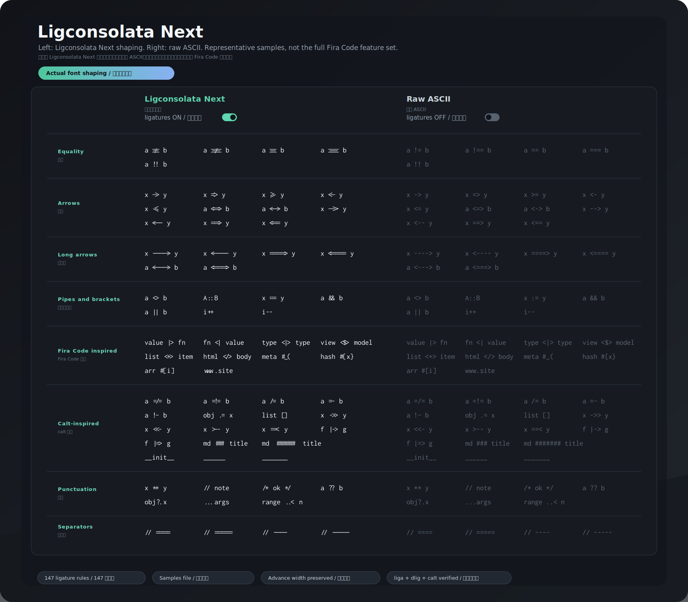

# Ligconsolata Next



[中文说明](README.zh-CN.md)

Ligconsolata Next is a fork of [Inconsolata](https://github.com/googlefonts/inconsolata) for people who like Inconsolata's quiet texture, but want a more practical coding-ligature experience in modern editors.

The original Inconsolata source already contains a small set of programming ligatures. In the upstream family, those ligatures live in `dlig`, which is usually disabled by default. The older Ligconsolata idea exposed them through `liga`, but that variant did not move forward with the Inconsolata v3 variable-font work. This fork picks that thread back up under a new family name: **Ligconsolata Next**.

## Why This Fork

- Keep the feel of Inconsolata instead of switching to a completely different programming font.
- Make the existing operator ligatures work by default in editors that enable standard font ligatures.
- Add new ligatures gradually, using Inconsolata's own shapes as the design source.
- Avoid shipping a modified font under the upstream `Inconsolata` family name.

This project is not an official Google Fonts or upstream Inconsolata release. It keeps the upstream history and OFL license intact while making the derivative name explicit.

## Relationship To Fira Code

[Fira Code](https://github.com/tonsky/FiraCode) is an important source of inspiration for this fork. Its programming ligature coverage, contextual-arrow handling, and specimen style are excellent references for what developers expect from a modern coding font.

Ligconsolata Next does not try to become a copy of Fira Code. The point of this project is to continue the Ligconsolata idea on top of Inconsolata: keep Inconsolata's letterforms, braces, rhythm, and texture, then improve the operator ligature experience around that existing design. For that reason, Fira Code is used as a product and OpenType-behavior reference, while the actual glyph outlines are drawn, assembled, or adjusted from Inconsolata-family shapes.

## What Changed So Far

- The source family is now named `Ligconsolata Next`.
- The existing Inconsolata operator ligatures are exposed through `liga` as well as `dlig`.
- The current default-on set includes the inherited operators, Fira Code-inspired fixed operator coverage, a first batch of Fira Code `calt`-inspired fixed forms, contextual long arrows, and separator-run helpers for `====` / `----` style comment dividers.
- The build notes now point at the files that exist in this repo: `sources/Inconsolata.glyphs` and `sources/config.yaml`.

## Ligatures

Inconsolata used `dlig` for programming ligatures. Ligconsolata Next keeps `dlig` for compatibility and adds the same substitutions to `liga`, which is the feature most editors use when font ligatures are enabled.

The current supported set is:

- Inherited and refined: `!=`, `!==`, `==`, `===`, `->`, `=>`, `>=`, `<-`, `<=`.
- Added common operators: `<=>`, `<->`, `-->`, `<--`, `==>`, `<==`, `...`, `<>`, `::`, `:=`, `&&`, `||`, `++`, `--`, `**`, `//`, `/*`, `*/`, `??`, `?.`.
- Added Fira Code-inspired fixed coverage such as `<|>`, `<$>`, `<+>`, `</>`, `|>`, `<|`, `::=`, `:::`, `..=`, `..<`, `?=`, `!!`, `!!.`, `+++`, `***`, `///`, `#{`, `#[`, `#_(`, and related compact operator forms.
- Added a cautious Fira Code `calt`-inspired fixed batch for forms that can be represented safely without importing Fira Code's full contextual machinery: `##` through `########`, `__` through `______`, `=/=`, `=!=`, `=:=`, `=~`, `!~`, `/=`, `/==`, `.=`, `.-`, `:-`, `[]`, `->>`, `<<-`, `=>>`, `=<<`, `>--`, `--<`, `|--`, `--|`, `>==`, `==<`, `|==`, `==|`, `==/`, `>>-`, `>-`, `-<`, `|->`, `<-|`, `|=>`, `<=|`, `||-`, `-||`, `|-`, `-|`.
- Added Fira Code-style contextual arrow extension for longer `-` and `=` arrows, using `calt` start/middle/end segment glyphs rather than enumerating every length.
- Added the first contextual pipe/bar endpoint arrow batch for longer single-pipe endpoints such as `|--->`, `<---|`, `|===>`, and `<===|`, while keeping short forms like `|--` and `==|` as fixed glyphs.
- Added a small contextual slash / marker batch for longer `=` runs, including `/===>`, `<===/`, `===/===`, `==:=`, and `==!=`, while keeping short forms such as `/=`, `/==`, `==/`, `=:=`, and `=!=` as fixed glyphs.
- Added contextual punctuation alignment for `:<`, `:>`, `<:`, `>:`, `<:>`, and `>:<`. This uses `.center` visual alternates in `calt`; it is not a new `.dlig` ligature.
- Added contextual underscore-run extension for runs longer than `______`, while keeping the shorter `__` through `______` fixed glyphs stable.
- Separator-run helpers: `====`, `=====`, `----`, `-----`.

The ordered feature rules, contextual arrow rules, and generated glyph blocks are maintained by `scripts/update-ligature-glyphs.py`. Fira Code is useful as a coverage reference, but new outlines are drawn, assembled, or scaled from Inconsolata-family glyphs rather than copied.

For implementation notes and migration pitfalls, see [Ligconsolata Next ligature porting notes](documentation/ligature-porting-notes.md).
For a fuller visual catalog of the current changes, see [Ligconsolata Next optimization catalog](documentation/ligconsolata-next-optimizations.md).

For developer-oriented background reading, start with the font basics series:

- [从活字到字体源码](documentation/blog/00-from-movable-type-to-font-source.md)
- [字形怎样学会复用](documentation/blog/font-basics-01-movable-type.md)
- [中文字体走进现代出版](documentation/blog/font-basics-02-modern-chinese-printing.md)
- [西文字体穿过机器时代](documentation/blog/font-basics-03-global-type-history.md)
- [那些熟悉的字体从哪里来](documentation/blog/font-basics-04-typeface-case-studies.md)
- [字体从像素格走向轮廓](documentation/blog/font-basics-05-bitmap-to-outline.md)
- [可变字体把变化装进一个文件](documentation/blog/font-basics-06-variable-fonts.md)
- [连字让源码换一种读法](documentation/blog/font-basics-07-opentype-shaping-and-ligatures.md)
- [字体源码藏在哪些文件里](documentation/blog/font-basics-08-font-source.md)
- [Ligconsolata Next 的连字改造](documentation/blog/font-basics-09-ligconsolata-next.md)
- [AI 改字体时到底在做什么](documentation/blog/01-vibe-coding-a-programming-font.md)
- [不会字体设计，也能看懂字体改动](documentation/blog/02-reviewing-ai-font-changes.md)

## Building The Family

The project source is in Glyphs format:

- `sources/Inconsolata.glyphs`
- `sources/config.yaml`

The dependency set is old, so use a dedicated Python environment. On this machine, Python 3.10 is the safest first target:

```sh
/opt/homebrew/bin/python3.10 -m venv .venv
source .venv/bin/activate
python -m pip install "pip==23.3.2" "setuptools==58.5.3" "wheel==0.37.1"
python -m pip install --no-build-isolation -r requirements.txt
```

Then try the current Google Fonts builder entry:

```sh
gftools builder sources/config.yaml
```

For a quicker source smoke test that does not overwrite the checked-in font binaries:

```sh
fontmake -g sources/Inconsolata.glyphs -o variable \
  --master-dir "{tmp}" \
  --output-path "/tmp/ligconsolata-next-smoke/LigconsolataNext[wdth,wght].ttf"
```

Useful smoke checks after a build:

```sh
python - <<'PY'
from fontTools.ttLib import TTFont

font = TTFont("/tmp/ligconsolata-next-smoke/LigconsolataNext[wdth,wght].ttf")
names = sorted({n.toUnicode() for n in font["name"].names if n.nameID in {1, 4, 6}})
features = sorted({r.FeatureTag for r in font["GSUB"].table.FeatureList.FeatureRecord})
print(names)
print(features)
PY
```

The expected result is that the name table uses `Ligconsolata Next`, and GSUB contains `liga`.

To regenerate the README overview image from the configured code samples:

```sh
python scripts/generate-overview-svg.py --build
```

The samples are intentionally plain ASCII in `documentation/overview-samples.txt`; `##` headings become grouped sections in the generated SVG. The overview is representative rather than exhaustive; the supported rule source of truth is `scripts/update-ligature-glyphs.py`.

To regenerate the generated ligature glyphs and rewrite the ordered `dlig` / `liga` rules:

```sh
python scripts/update-ligature-glyphs.py
```

To build the editable browser comparison demo:

```sh
python scripts/build-demo-assets.py
```

Then open `documentation/demo/index.html`. The generated demo font files live under `documentation/demo/fonts/` and are intentionally ignored by git.

## Adding More Ligatures

For a safe design workflow:

1. Prefer adding repeatable recipes to `scripts/update-ligature-glyphs.py`.
2. Add the generated glyph as a `.dlig` glyph in `sources/Inconsolata.glyphs`.
3. Reuse or adapt existing Inconsolata outlines where possible.
4. Add the substitution to both `dlig` and `liga`, keeping longer sequences before shorter ones.
5. Build, then inspect the GSUB table and a visual specimen.
6. Only then add the ligature to the README hero/sample list.

Avoid importing Fira Code glyph outlines. Fira Code is a useful reference for what programmers expect, but Ligconsolata Next should stay visually rooted in Inconsolata.

## Acknowledgements

Special thanks to the [Fira Code](https://github.com/tonsky/FiraCode) project for showing how thoughtful programming ligatures can make code easier to scan while still preserving plain ASCII source text. Ligconsolata Next borrows inspiration from that work with gratitude, while keeping its own design rooted in Inconsolata.

## Upstream Inconsolata Notes

Inconsolata is an open-source monospace font for code listings, originally by [Raph Levien](https://github.com/raphlinus/).

### Changelog v3.000

Upgrade to 2-axis variable font family, with widths from 50 to 200, and weights from 200 to 900.

### Changelog v2.013

- Removed ligatures for `fi` and `fl`.
- Operator ligatures moved to `dlig`.
- New variant "Ligconsolata" introduced, which exposes operator ligatures as `liga`.

### Changelog v2.011

March 2018 glyph set expansion was completed by [Brenton Simpson](https://github.com/appsforartists/), which included:

- Glyph set expanded to include ligatures for `===`, `!==`, `=>`, `<=`, `>=`, `->`, `<-`.

### Changelog v2.001

August 2016 glyph set expansion was completed by Alexei Vanyashin, which included:

- Glyph set expanded to GF Latin Pro.
- Additional symbols and minor design improvements.

## License

This Font Software is licensed under the SIL Open Font License, Version 1.1. See [OFL.txt](OFL.txt).

## Copyright

Copyright 2026 The Ligconsolata Next Project Authors

Copyright 2006 The Inconsolata Project Authors

## Links

- [Original Inconsolata repo](https://github.com/googlefonts/inconsolata)
- [Inconsolata on Google Fonts](https://fonts.google.com/specimen/Inconsolata)
- [Inconsolata on Levien.com](http://levien.com/type/myfonts/inconsolata.html)
- [fontmake](https://github.com/googlefonts/fontmake)
