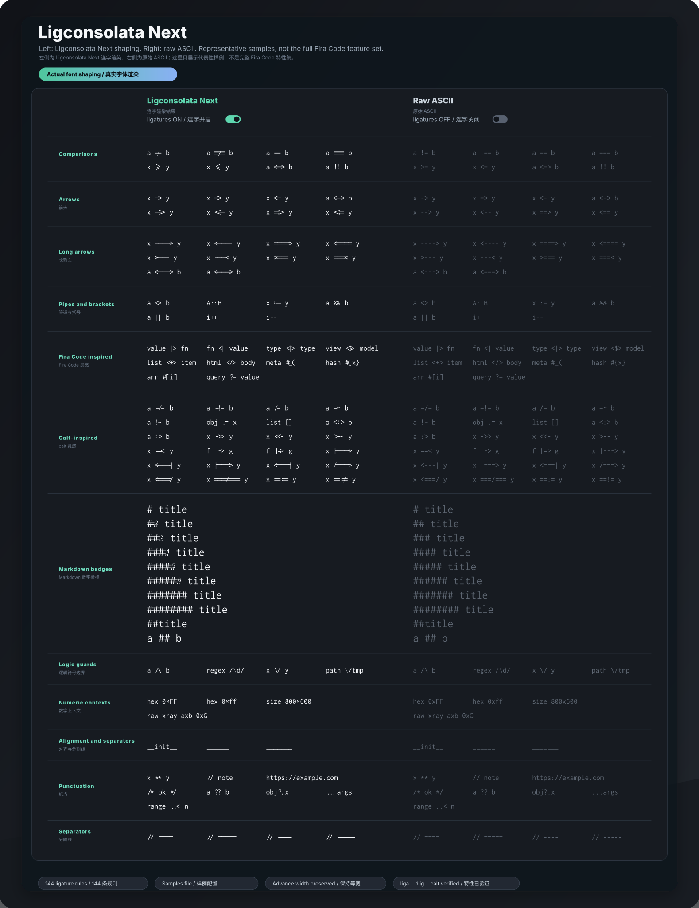

# Ligconsolata Next



[English README](README.md)

Ligconsolata Next 是 [Inconsolata](https://github.com/googlefonts/inconsolata) 的一个 fork。它想保留 Inconsolata 安静、耐看的代码字体气质，同时把编程连字做得更适合现代编辑器。

## 为什么要 Fork

Inconsolata 源码里本来就有一小组编程连字，例如 `!==`、`=>`、`<=`。上游在 v2.013 之后把这些连字放在 `dlig` 里，而大多数编辑器默认只打开标准 `liga`，所以用户通常看不到这些效果。

早期的 Ligconsolata 思路是把这些连字暴露到 `liga`，但那个方向没有继续跟进 Inconsolata v3 的可变字体源码。Ligconsolata Next 接着这个方向往下做，并且换成新的 family name，避免把修改版字体继续伪装成上游 `Inconsolata`。

这个项目不是 Google Fonts 或上游 Inconsolata 的官方发布版。它会保留上游历史和 OFL 授权，同时明确使用派生字体名：**Ligconsolata Next**。

## 和 Fira Code 的关系

[Fira Code](https://github.com/tonsky/FiraCode) 是这个 fork 很重要的灵感来源。它的编程连字覆盖面、可变长度箭头处理方式，以及 specimen 展示方式，都很适合作为现代代码字体连字体验的参考。

但 Ligconsolata Next 不是要做一个 Fira Code 复制品。这个项目的出发点是在 Ligconsolata / Inconsolata 这条线上继续补充连字：保留 Inconsolata 的字母、大括号、整体节奏和阅读气质，只把操作符连字体验补起来。所以我们参考 Fira Code 的连字类别、OpenType 行为和展示思路，但实际 glyph outline 仍然从 Inconsolata 自己的字形里派生、组合或调整，不直接照搬 Fira Code 的字形。

## 目前已经改了什么

- 字体 family name 改为 `Ligconsolata Next`。
- 现有的 Inconsolata 编程连字继续保留在 `dlig`，同时复制到 `liga`，让编辑器启用普通字体连字时也能生效。
- 当前默认启用的连字包括上游已有操作符、补充并修正过的两字符相等 / 不等形态、参考 Fira Code 补充的一批固定操作符、第一批参考 Fira Code `calt` 行为的固定组合、可变长度箭头、大小写上下文标点，以及为 `====` / `----` 这类注释分割线准备的连续横线规则。
- `emdash` (U+2014) 和 `horizontalbar` (U+2015) 已调整为两倍 Latin cell 宽度，并且横线会延伸到 advance 两端，让中文混排里的 `——` 连成一整条线。
- 构建说明改为指向当前仓库真实存在的源码：`sources/Inconsolata.glyphs` 和 `sources/config.yaml`。
- 顶部 overview SVG 已改成从临时构建出来的字体中提取真实 glyph outline，不再用 `⇒`、`≤`、`≠` 这类 Unicode 符号近似代替。

需要注意：当前 SVG 对图里展示的样例是可信的字体 specimen，因为它来自实际构建产物；但它不是动态预览。后续只要修改 glyph 或 OpenType feature，就要重新构建字体并重新生成 SVG。

更详细的适配问题、解决方式和可迁移经验，见 [Ligconsolata Next 连字迁移复盘](documentation/ligature-porting-notes.md)。
更完整的视觉清单和分类说明，见 [Ligconsolata Next 优化目录](documentation/ligconsolata-next-optimizations.md)。
如果只想检查 `=>` 这类旧版已经支持的继承连字有没有跑偏，见 [继承连字对比图](documentation/img/ligconsolata-next-inherited-comparison.svg)。
后续借鉴外部编码字体时，先看 [外部编码字体参考索引](documentation/external-font-reference-index.md)。
要检查易混字符、操作符歧义、字号、字重和深浅背景，见 [Ligconsolata Next 视觉 QA](documentation/ligconsolata-next-qa.md)。

如果想了解这轮改造背后的字体设计基础、历史脉络和 AI review 方法，可以继续看：

- [从活字到字体源码](documentation/blog/00-from-movable-type-to-font-source.md)
- [字形怎样学会复用](documentation/blog/font-basics-01-movable-type.md)
- [中文字体走进现代出版](documentation/blog/font-basics-02-modern-chinese-printing.md)
- [西文字体穿过机器时代](documentation/blog/font-basics-03-global-type-history.md)
- [那些熟悉的字体从哪里来](documentation/blog/font-basics-04-typeface-case-studies.md)
- [字体从像素格走向轮廓](documentation/blog/font-basics-05-bitmap-to-outline.md)
- [可变字体把变化装进一个文件](documentation/blog/font-basics-06-variable-fonts.md)
- [连字让源码换一种读法](documentation/blog/font-basics-07-opentype-shaping-and-ligatures.md)
- [字体源码藏在哪些文件里](documentation/blog/font-basics-08-font-source.md)
- [Ligconsolata Next 的连字改造](documentation/blog/font-basics-09-ligconsolata-next.md)
- [AI 改字体时到底在做什么](documentation/blog/01-vibe-coding-a-programming-font.md)
- [不会字体设计，也能看懂字体改动](documentation/blog/02-reviewing-ai-font-changes.md)

## 构建环境

这个仓库的依赖比较旧，建议使用独立 Python 3.10 环境。当前机器上可用的初始化方式是：

```sh
/opt/homebrew/bin/python3.10 -m venv .venv
source .venv/bin/activate
python -m pip install "pip==23.3.2" "setuptools==58.5.3" "wheel==0.37.1"
python -m pip install --no-build-isolation -r requirements.txt
```

完整构建入口仍然是 Google Fonts 的 builder 配置：

```sh
gftools builder sources/config.yaml
```

开发时可以先用不会覆盖仓库内字体文件的 smoke build：

```sh
fontmake -g sources/Inconsolata.glyphs -o variable \
  --master-dir "{tmp}" \
  --output-path "/tmp/ligconsolata-next-smoke/LigconsolataNext[wdth,wght].ttf"
```

构建后至少检查两件事：name table 应该是 `Ligconsolata Next`，GSUB 里应该包含 `liga`。

```sh
python - <<'PY'
from fontTools.ttLib import TTFont

font = TTFont("/tmp/ligconsolata-next-smoke/LigconsolataNext[wdth,wght].ttf")
names = sorted({n.toUnicode() for n in font["name"].names if n.nameID in {1, 4, 6}})
features = sorted({r.FeatureTag for r in font["GSUB"].table.FeatureList.FeatureRecord})
print(names)
print(features)
PY
```

重新生成 README 顶部 overview SVG：

```sh
python scripts/generate-overview-svg.py --build
```

样例配置在 `documentation/overview-samples.txt`，真实 ASCII 代码片段按行写；`##` 标题会变成 SVG 里的分组。overview 是代表性样例，不是完整清单；完整支持范围以 `scripts/update-ligature-glyphs.py` 里的规则为准。

重新生成继承连字对比图：

```sh
python scripts/generate-inherited-comparison-svg.py --build
```

重新生成视觉 QA SVG：

```sh
python scripts/generate-qa-svg.py \
  --font "/tmp/ligconsolata-next-smoke/LigconsolataNext[wdth,wght].ttf"
```

重新生成脚本派生的连字 glyph，并同步改写 `dlig` / `liga` 规则：

```sh
python scripts/update-ligature-glyphs.py
```

生成可编辑的浏览器真实对比 demo：

```sh
python scripts/build-demo-assets.py
```

然后打开 `documentation/demo/index.html`。脚本会把原始 Inconsolata 和当前 Ligconsolata Next 构建产物放到 `documentation/demo/fonts/`，这个目录是本地生成物，不进 git。Ligconsolata Next demo 字体每次构建后都会自动递增面向安装的内部版本号，方便 macOS 本地安装识别新构建；这个递增不会改 `sources/Inconsolata.glyphs` 里的基础 `versionMajor` / `versionMinor`。

## 后续怎么加连字

后续可以参考 Fira Code 的连字类别和展示方式，但不要复制 Fira Code 的字形轮廓。Ligconsolata Next 应该继续从 Inconsolata 自己的笔画、比例和节奏里长出来。

如果想按功能组查看当前已经实现了什么，可以看 [Ligconsolata Next feature gallery](documentation/ligconsolata-next-feature-gallery.md)。这个文档会为每类特性生成一张单独的 SVG，并在最后列出脚本当前维护的完整规则清单。

当前支持范围：

- 当前上游 `dlig` baseline 已有并继续保留：`!==`、`===`、`->`、`=>`、`>=`、`<-`、`<=`。
- Next 补充并修正的两字符相等 / 不等形态：`!=`、`==`。
- 新增常用操作符：`<=>`、`<->`、`-->`、`<--`、`==>`、`<==`、`...`、`<>`、`::`、`:=`、`&&`、`||`、`++`、`--`、`**`、带上下文保护的行注释前缀、块注释边界、`??`、`?.`。
- 参考 Fira Code 补充的固定操作符：例如 `<|>`、`<$>`、`<+>`、`</>`、`|>`、`<|`、`::=`、`:::`、`..=`、`..<`、`?=`、`!!`、`!!.`、`+++`、`***`、`#{`、`#[`、`#_(` 等，以及一批相关的紧凑操作符组合；`//` / `///` 虽然有 glyph，但只在注释前缀上下文启用。
- `www` 保持 raw 文本，不放进默认合并规则，这样 URL、域名和普通英文文本仍然容易扫读。
- 参考 Fira Code `calt` 行为补充的低风险固定组合：`__` 到 `______`、`=/=`、`=!=`、`=:=`、`=~`、`!~`、`/=`、`/==`、`.=`、`.-`、`:-`、`[]`、`->>`、`<<-`、`=>>`、`=<<`、`>--`、`--<`、`|--`、`--|`、`>==`、`==<`、`|==`、`==|`、`==/`、`>>-`、`>-`、`-<`、`|->`、`<-|`、`|=>`、`<=|`、`||-`、`-||`、`|-`、`-|`。这些先按固定连字处理，不假装已经完整迁入 Fira Code 的所有上下文型 `calt` 机器。
- 可变长度箭头：参考 Fira Code 的 `calt` 思路，用 start / middle / end 片段支持更长的 `-` / `=` 箭头，例如 `---->`、`<----`、`====>`、`<====`、`<--->`、`<===>`，以及单 `>` / `<` 端点的 `>---`、`---<`、`>===`、`===<`。
- 第一批 pipe/bar 端点长箭头：支持单 `|` 端点的长 `-` / `=` 箭头，例如 `|--->`、`<---|`、`|===>`、`<===|`；短组合 `|--`、`--|`、`|==`、`==|` 仍由固定 glyph 负责。
- 第一批 slash / marker 上下文组合：支持长 `=` 串里的 `/` 端点、单 `/` 中间标记和 `:` / `!` 中间标记，例如 `/===>`、`<===/`、`===/===`、`==:=`、`==!=`；短组合 `/=`、`/==`、`==/`、`=:=`、`=!=` 仍由固定 glyph 负责。
- 第一批标点居中：`:<`、`:>`、`<:`、`>:`、`<:>`、`>:<` 会在 `calt` 中切换到 `.center` 视觉变体。这只是标点对齐，不是新增 `.dlig` 连字。
- 第一批大小写上下文标点：`var-name`、`a+b`、`*ptr` 会把 `-`、`+`、`*` 切换到更贴近小写字母高度的 `.lc` 视觉变体；`CONST:VALUE` 会把 `:` 切换到更贴近大写字母高度的 `.uc` 视觉变体。
- 数字上下文里的小写 `x`：`0xFF`、`0xff`、`800x600` 会把 `x` 切换成从 Inconsolata 自身 `multiply` 派生的乘号形态；普通单词 `xray`、`axb`、无效十六进制样式 `0xG` 和大写 `X` 保持原样。
- 可变长度下划线：`__` 到 `______` 继续使用固定 glyph，超过这个长度后用 `underscore_start.seq` / `underscore_middle.seq` / `underscore_end.seq` 片段延展。
- Markdown 标题里的连续 `#` 采用分层方案：行首且后接普通空格的 `## title` 到 `###### title` 保持原始总 advance width，把井号横杠连成一组，并在最后一个 `#` 的右上区域嵌入数字 `2` 到 `6`；单个 `#`、`##title`、`a ## b` 保持原始字符；`#######` 及更长 run 会连成无编号的井号横杠序列，让长分割线保持连续，但不假装成 Markdown 标题层级。
- 注释分割线辅助：`====`、`=====`、`----`、`-----`。

`//` / `///` 连字是有意加了上下文限制的：只有 `// comment`、`/// reference` 这种后面跟普通空格的注释前缀会触发；`https://example.com`、`file:///tmp/font` 这类 URL 会保留原始斜线，避免阅读链接时被误伤。

`/*` / `*/` 块注释边界也加了保护：`/*` 需要后接普通空格，`*/` 需要前接普通空格。像 `**/*.{ts,tsx}`、`!**/composables/**/*.ts` 这样的 glob 模式会保留原始 `/*` / `*/`，但 `**` 仍然可以正常连写。

`/\` / `\/` 也改成了上下文规则：只有 `a /\ b`、`x \/ y` 这种两侧都有空格的独立逻辑操作符会触发；`/\d/`、`\/tmp` 这类正则和路径保持原始斜线 / 反斜线。

Fira Code 还有很多可选 character variants 和 stylistic sets。Ligconsolata Next 不把整套 variant 系统塞进默认连写里；当前编码体验仍然只依赖 `liga` 和 `calt`。细反斜杠通过 `calt` 把 `backslash` 换成 `backslash.thin`，这样普通编辑器的“启用连写”路径也能看到它，不需要额外开启 stylistic set。

另有一个不属于 GSUB 连字的标点修正：`emdash` (U+2014) 和 `horizontalbar` (U+2015) 现在会保持两倍当前 Latin cell advance width，并且横线轮廓延伸到当前 advance 两端，所以 `——`、`———` 这类连续中文破折号会自然连成一整条。`endash` (U+2013) 和 `figuredash` (U+2012) 仍保持一格，避免影响普通西文标点和数字排版。

比较稳的流程是：

1. 优先把可重复的派生逻辑写进 `scripts/update-ligature-glyphs.py`。
2. 让脚本在 `sources/Inconsolata.glyphs` 里生成或替换 `.dlig` glyph。
3. 尽量复用、组合或改造 Inconsolata 已有字形，不要引入外部字体 outline。
4. 同时把替换规则加到 `dlig` 和 `liga`，并保持长序列先于短序列。
5. 构建临时字体，检查 GSUB、name table 和连字 advance width。
6. 用真实构建产物重新生成 overview SVG 或其他 specimen。
7. 视觉确认后，再把新连字写进 README。

如果要重新生成分组图库：

```sh
python scripts/generate-feature-gallery.py
```

最重要的宽度规则是：连字 glyph 的 advance width 必须等于原始字符序列的总 advance width。比如当前 Regular 默认位置里，`=>` 和 `<=` 都应保持 1000，`!==` 应保持 1500。这样编辑器里光标移动、对齐和代码列宽才不会被破坏。

长 `====` / `----` 分割线只能由字体尽量改善视觉连续性，不能反过来修正源码里字符数量不一致的问题。如果需要生成两条 `=` 分割线和一条 `-` 分割线，仍建议由代码生成固定长度的文本，避免手写时上下差一个字符。

## 致谢

特别感谢 [Fira Code](https://github.com/tonsky/FiraCode) 项目带来的启发：它很好地证明了，设计得足够克制的编程连字可以让代码更容易扫读，同时仍然保留源码里的纯 ASCII 文本。Ligconsolata Next 会带着这份启发继续往前做，但视觉根基仍然留在 Inconsolata。

## 授权

本字体软件继续使用 SIL Open Font License, Version 1.1。详见 [OFL.txt](OFL.txt)。
