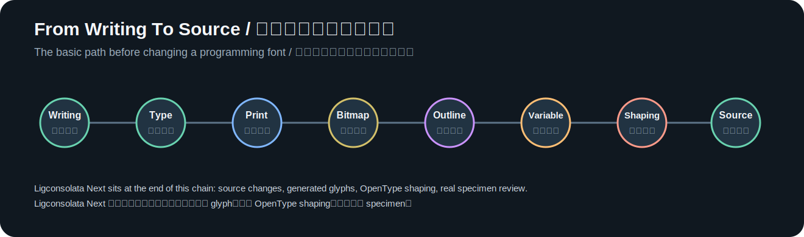

# 从活字到字体源码

改一款编程字体之前，先要知道字体到底是什么。

字体不是一张张字形截图，也不只是系统里一个 `.ttf` 文件。它更像一套跨越媒介的生产系统：书写传统提供字形审美，印刷技术把字形变成可复用字模，数字字体把字模变成轮廓、指标和排版规则，开源字体项目再把这些内容放进源码、配置、脚本和测试里。

Ligconsolata Next 只是这条长线末端的一个很小案例。它没有重新发明 Inconsolata，而是在 Inconsolata 的字母气质里补上更适合程序员阅读的 OpenType 连字。要 review 这样的改动，不能只问“这几个符号好不好看”，还要知道字形为什么要复用、为什么要服务印刷和屏幕、为什么等宽字体不能破坏 advance width、为什么源码字符不能被偷换。

这组文章写给“不懂字体设计，但想看懂字体项目”的开发者。读完以后，不需要马上会画一整套字体，但应该能分清几个关键边界：书法风格和现代字体文件不是一回事，TTF/OTF 不是源码，点阵和轮廓解决的是字形显示问题，OpenType feature 解决的是 glyph 替换和定位问题，编程连字改变的是显示结果，不是源码字符。

## 阅读路线

1. [字形怎样学会复用](font-basics-01-movable-type.md)
2. [中文字体走进现代出版](font-basics-02-modern-chinese-printing.md)
3. [西文字体穿过机器时代](font-basics-03-global-type-history.md)
4. [那些熟悉的字体从哪里来](font-basics-04-typeface-case-studies.md)
5. [字体从像素格走向轮廓](font-basics-05-bitmap-to-outline.md)
6. [可变字体把变化装进一个文件](font-basics-06-variable-fonts.md)
7. [连字让源码换一种读法](font-basics-07-opentype-shaping-and-ligatures.md)
8. [字体源码藏在哪些文件里](font-basics-08-font-source.md)
9. [Ligconsolata Next 的连字改造](font-basics-09-ligconsolata-next.md)

后面两篇更偏项目经验：

- [AI 改字体时到底在做什么](01-vibe-coding-a-programming-font.md)
- [不会字体设计，也能看懂字体改动](02-reviewing-ai-font-changes.md)

这条阅读路线故意没有从 Ligconsolata Next 直接开始。项目本身只是一个入口，真正要建立的是判断力：看到一张字体截图时，知道它是不是来自真实字体；看到一个连字时，知道要检查源码字符、GSUB、宽度和视觉；看到一个 AI 生成的 glyph 时，知道它可能哪里“能跑但不该发布”。

可以用 `=>` 这两个字符串起整条链路。源文件里保存的是 `=` 和 `>` 两个 ASCII 字符；字体先通过字符映射找到 `equal` 和 `greater` glyph；OpenType feature 再把这两个 glyph 替换成一个箭头连字 glyph；这个 glyph 的 advance width 仍然要等于两个等宽字符；最后 specimen 和 HTML demo 再证明真实字体确实这么显示。一个看似简单的箭头，已经经过字符、glyph、feature、metrics、渲染和视觉 review。

## 为什么要从历史讲起

如果只从 TTF、OTF、GSUB 这些术语开始，字体会显得像一团软件黑话。其实它的核心问题很朴素：人类先要把字写得可识别，再要把字印得可复制，后来才把字显示在屏幕上。

没有计算机的时候，字体靠材料、工艺、字模、铸字、校样和印刷反馈存在。泥活字、木活字、铅活字、报纸铅排、连环画、宣传册和广告招贴，都在训练同一个能力：把字形变成可以大规模生产的东西。到了数字时代，这个能力换成了 glyph、轮廓、metrics、hinting、variation axis、OpenType feature 和源码仓库。

这也是为什么这组文章先讲书写和印刷，再讲点阵、轮廓、可变字体和连字。字体从始至终都不是孤立美术品。它先服务阅读、印刷和传播，后来才同时服务屏幕、界面、代码和软件工程。

历史部分还有一个作用：把“字体是工程”这件事讲清楚。泥活字要考虑材料，木活字要考虑磨损，铅活字要考虑铸造和油墨，报纸要考虑速度，工具书要考虑小字号清晰，激光照排要考虑大字符集和输出设备。今天改一个编程连字，也要考虑源码、构建、渲染、宽度、demo 和文档。技术换了，系统思维没有变。

## 读完以后应该能做什么

这组文章不要求读者成为字体设计师，但希望读者能做几件更实际的事。

第一，能看懂字体项目的基本文件。`sources/Inconsolata.glyphs` 是主要源码，`sources/config.yaml` 是构建配置，`.nam` 更像字符集清单，`fonts/` 里的 TTF/OTF 是构建产物。知道这些以后，改字体就不会直接去编辑二进制产物。

第二，能 review 编程连字。一个连字至少要检查四件事：源码字符没有变，OpenType 替换真的命中，advance width 没有破坏等宽，视觉上没有混淆 `==` / `===`、`!=` / `!==` 这类相近操作符。

第三，能判断 AI 的工作边界。AI 可以整理资料、生成脚本、补候选 glyph、写初稿和做第二视角检查，但它不能替代最终视觉判断。字体项目里很多错误都不是语法错误，而是“看起来不对”“小字号糊掉”“风格不像这款字体”。

## 资料边界

字体史很长，很多机构、年代和字体来源容易被简化成一句传说。这组文章尽量只在有资料支撑的地方写具体年代和机构名称：

- 活字印刷和 Gutenberg 相关事实优先参考 Britannica 等通用权威资料。
- 上海印刷技术研究所、宋一体、黑一体、宋二体、新魏体等内容优先参考中国近现代新闻出版博物馆、上海印刷字体展示馆相关报道和上海活字档案。
- 王选院士、华光激光照排系统和中文印刷数字化优先参考北京大学、人民日报转载资料和出版行业资料。
- Microsoft、Apple、Adobe、Google 字体相关事实优先参考官方字体列表、官方仓库和官方说明。
- 解释 OpenType、TrueType、GSUB、可变字体时，优先参考 Microsoft OpenType 规范和 Glyphs Handbook。

这不是完整字体史，也不是专业字体设计教材。它的目标更具体：让程序员知道字体设计最基本的脉络，能读懂一个字体源码仓库，也能对 AI 生成的字体改动做最基本的 review。
