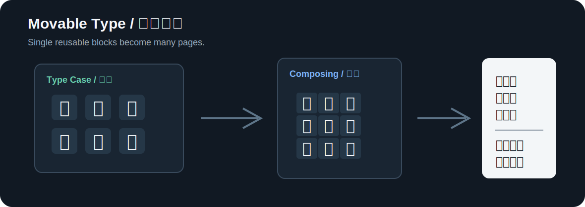
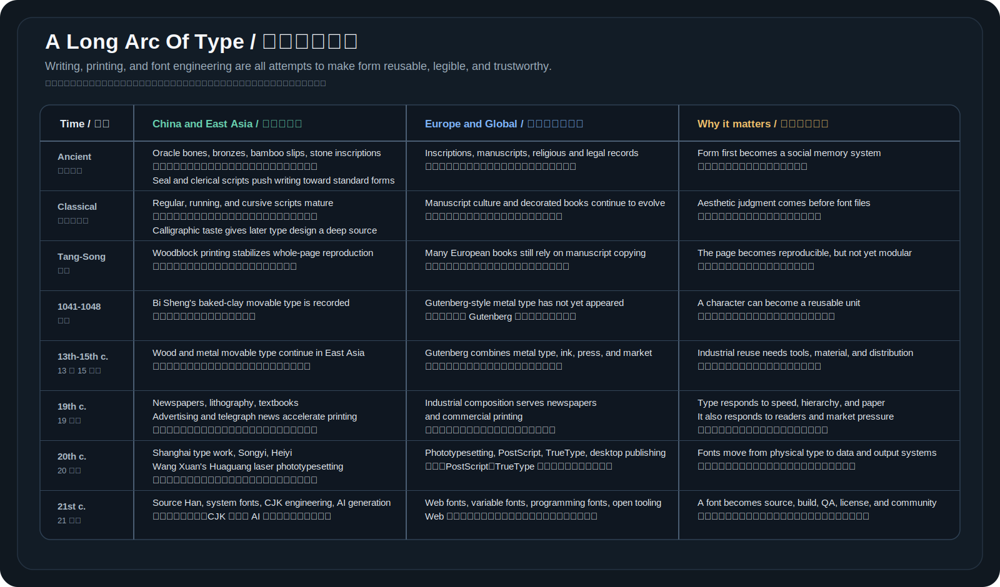

# 字形怎样学会复用

字体设计最早的问题不是“这个字好不好看”，而是“这个字能不能被稳定地重复生产”。这句话放在今天也成立。屏幕上的一个 `a`、一个 `字`、一个 `=`，都不是临时画出来的图案，而是从字体里取出的可复用 glyph。

在没有计算机的时代，字形复用靠的是更具体的东西：手写范本、刻版、泥活字、木活字、金属活字、铅字、字盘和印刷工人。它们看起来离 `.glyphs` 文件很远，但解决的其实是同一个问题：让字形可以被调用、排列、复制和检查。

这条线很长，长到足够穿过几千年的材料、制度和日常生活。文字先刻在甲骨和青铜上，后来进入竹帛、石碑、纸张、木版、泥活字、铅字、照排机、打印机、屏幕和字体源码。每一次媒介改变，字都要重新回答几个问题：形状怎么稳定，错误怎么发现，读者怎么相信它，更多的人怎样更快地看到它。

这也是字体史真正有力量的地方。它不是一串孤立发明，也不是“古代手工”到“现代软件”的简单升级。它更像一条不断改道的大河：书写传统提供字形的骨架和气质，印刷技术提供复制的速度和规模，现代字体工程再把字形、编码、排版规则、构建脚本和质量检查放进同一个系统里。

## 文字先穿过了材料和制度

在现代字体出现以前，字形已经在不同材料上被反复训练。甲骨和青铜让文字进入祭祀、记事和权力秩序；竹简、帛书和纸张让文字变得更适合书写、整理和流通；碑刻和墓志把字形固定在石头上，让后人看到一代人如何理解结构、笔势和庄重感。

这些材料不只是载体，也会反过来改变字。刻在硬材料上的线条要考虑刀法、凿刻和耐久，写在纸上的线条要考虑笔锋、速度和墨色，印在纸上的线条要考虑油墨、压力和纸张吸收。字体工程后来用轮廓、hinting、metrics 和 shaping 解决问题，但问题本身很早就存在：同一个字怎样在不同媒介里保持自己，又不失去可读性。

汉字的标准化也很早就和制度连在一起。小篆、隶书、楷书不是“审美换皮”，而是书写速度、行政管理、教育传播和读者习惯共同作用的结果。The Metropolitan Museum of Art 的 [Chinese Calligraphy](https://www.metmuseum.org/toah/hd/chcl/hd_chcl.htm) 简介也把 seal、clerical、regular、running、cursive 等脚本放在中国书法传统的长线里看。对字体设计来说，这些脚本不是现代字体文件，却提供了后来的结构判断：横竖怎样站住，重心怎样放稳，字内空间怎样呼吸。

西方和其他地区也有类似的长线。石刻铭文、莎草纸、羊皮纸、修道院抄本、装饰手稿和宗教书籍，都在训练各自文字系统的字形规则。不同文字系统进入印刷时代的方式不同，但它们都先在手写和刻写里形成了审美、规范和阅读习惯。

## 先有书写传统，后来才有现代字体

讲中国字体史不能只讲活字印刷。活字解决的是生产方式，书法传统解决的是字形审美、结构和笔势。现代意义上的字体文件出现以前，中国已经有很成熟的书写风格。

从文字演变看，篆书、隶书、楷书、行书、草书代表了不同的书写系统和速度。篆书更接近古文字和铭刻传统，隶书把很多圆转线条压平成波磔和横势，楷书逐渐成为规范书写的骨架，行书和草书则保留更多连续书写的速度感。

从书家风格看，王羲之、欧阳询、颜真卿、柳公权、赵孟頫、宋徽宗等人的作品都长期影响后来的字形判断。颜体厚重开阔，柳体骨力紧劲，欧体结构严整，赵体圆润流动，宋徽宗的瘦金体则以细劲、挺拔和强烈个人风格著称。

这些不是现代意义上的字体文件。书法作品是书写和范本传统，字体是面向复用、排版、字号、媒介和授权的系统。它们的关系更像“审美来源”和“工程化应用”：后来很多印刷字体、标题字、美术字和数字字体都会从书法传统里取结构、笔意和语气，但必须重新适配印刷、屏幕和批量生产。

这里最容易误会的是“古代有没有字体”。如果把字体理解成今天能安装的字体文件，古代当然没有；如果把字体理解成一套稳定的字形风格、结构规则和审美范本，古代中国已经非常丰富。颜体、柳体、欧体、瘦金体这类说法，说明汉字从来不是只有一套标准形。不同书写传统会影响字的重心、开合、横竖比例、撇捺舒展程度和笔画收束方式。

印刷字体要从这些传统里抽取可复用部分。书法里同一个人写同一个字，每次都会因为速度、纸张、笔锋、墨色和情绪产生变化；字体里同一个 glyph 必须稳定。书法可以让某个字特别精彩，字体必须让几千个字放在同一页里都不突兀。这个转换本身就是字体设计最早的难点：从一次性的书写，变成可反复排印的系统。

图源：[Wikimedia Commons, File: 唐颜真卿祭姪文稿 卷.jpg](https://commons.wikimedia.org/wiki/File:%E5%94%90%E9%A1%8F%E7%9C%9F%E5%8D%BF%E7%A5%AD%E5%A7%AA%E6%96%87%E7%A8%BF_%E5%8D%B7.jpg)。这里用它说明书法范本如何长期影响字形审美，不把它等同为现代字体。

## 雕版解决一页，活字解决一个字

雕版印刷像是把一整页文字做成一张固定图像。优点是稳定，整页结构、文字和图像都固定在同一块板上；缺点是复用范围小，一页换了内容，整块板就不再适用。错一个字，可能要修整甚至重刻。

活字印刷把粒度降到单个字。每个字模都像一个可调用的函数：排版时把它放进版框，印刷后再放回字盘。一个常用字会在不同书页里出现无数次，只要字模还在，就可以继续使用。

这个思想和现代字体很接近。渲染器不会为每段文字重新“画字”，而是从字体里取出对应 glyph，再按字号、位置和排版规则显示出来。活字没有 Unicode，也没有 OpenType，但它已经把文字从一次性图像变成了可复用单元。

雕版和活字并不是简单的“旧技术”和“新技术”。雕版适合稳定文本，尤其是经典、经书、图文混排和长期重印的书。整版刻好之后，版面、行款、插图和文字都一起固定，印出来的整体感很强。活字适合内容经常变化、需要重排、需要快速组合的文本，但它也带来检字、排字、校对、收字和磨损管理的新成本。

汉字系统让这个成本更明显。拉丁字母只需要管理相对有限的字母、数字和标点，中文则要面对数千常用字、专名、异体字、偏旁结构和不同字号。一个字模能复用，但前提是排字工人能快速找到它、确认它、放回正确位置。字盘、检字法和排字流程因此成了字体系统的一部分。

## 毕昇的泥活字提出了关键模型

北宋毕昇的胶泥活字常被看作活字印刷的重要起点。[Britannica 的 movable type 条目](https://www.britannica.com/technology/movable-type)把中国 1041 到 1048 年前后的泥活字作为可移动字模的重要记录：字形先刻在胶泥上，再烧硬、排版、印刷。

泥活字的材料限制很明显。胶泥比金属脆，尺寸稳定性和耐久度有限；汉字数量巨大，字模管理也比字母文字复杂得多。它没有马上让中文印刷全面转向活字，但它提出了非常关键的模型：字形可以先被标准化，再被调出来使用。

把这个模型换成程序员熟悉的说法，就是把“每次手写”改成“定义一次，多处复用”。

这个模型还有一个隐含前提：字形必须能被放进统一规格里。活字不是随手写在纸上，而是一个个有边界、有高度、有字身尺寸的实体。某个字写得再漂亮，如果放进版框后比其他字高、黑、挤，整页就会乱。现代字体里的 em square、advance width、side bearing 和 vertical metrics，都可以在这里找到遥远的影子。

图源：[Wikimedia Commons, File: Chinese movable type 1313-ce.png](https://commons.wikimedia.org/wiki/File:Chinese_movable_type_1313-ce.png)。

## 木活字和金属活字让材料问题变得清楚

木活字更容易制作，也能在东亚印刷传统里找到不少应用。它的问题是材料会受木纹、湿度、磨损影响，长期使用后边缘和尺寸都可能变化。对于中文字库来说，成千上万个木活字还涉及分类、检字和存储。

金属活字把稳定性往前推了一步。金属可以铸造，耐磨，尺寸更容易统一，也更适合工业化印刷。铅活字时代的“字体”不再只是书法和刻工，而是铸造、排版、纸张、油墨和印刷压力共同作用的系统。

金属活字还改变了“复制”的方式。雕版是刻一整页，活字是排一整页；金属活字则可以通过字模、母型和铸造流程不断补充同一规格的字粒。印刷厂不只要有字形，还要有足够数量的常用字。一个“的”“是”“一”可能在同一版里出现很多次，只做一个字粒并不够用。字体在这里开始和库存、生产计划、常用字频率、排版速度绑定。

同一个字形设计，在不同材料里会遇到不同问题：

- 泥活字要考虑烧制后的变形和耐用性。
- 木活字要考虑雕刻精度、木纹和磨损。
- 铅活字要考虑铸造、字身尺寸、墨色和印刷压力。
- 数字字体要考虑轮廓、hinting、屏幕栅格化和 OpenType shaping。

媒介变了，核心问题没变：字形必须能被稳定复制。

这也是现代中文字体仍然很重的原因。一个拉丁字体项目可以先覆盖几百个 glyph，再逐步扩展；中文字体往往一开始就面对成千上万字。每个字都要进同一套结构、笔画粗细、重心和黑白关系里。书法传统给出审美参照，活字和铅字给出复用模型，真正的字体工程则要把这些全部变成可生产、可检查、可维护的系统。

## Gutenberg 把金属活字推向欧洲出版市场

欧洲印刷史里，Johannes Gutenberg 的价值不只是“用了活字”。[Britannica 对 Gutenberg 的介绍](https://www.britannica.com/summary/Johannes-Gutenberg)提到，他的系统把精确铸造的金属字模、金属合金、油性油墨和适合施压的印刷机结合起来。Gutenberg Bible 大约在 1455 年完成，它让可复用金属活字在欧洲进入规模化传播。

字母文字在活字系统里有天然优势：基础字母数量少，铸造和检字成本低。汉字系统则不同，常用字数量大，异体、部件和结构复杂。活字印刷在不同文字系统里的发展速度不同，不是单纯因为“谁更早发明”，还和字符数量、书籍市场、工艺、政治制度和商业网络有关。

图源：[Wikimedia Commons, File: Gutenberg Bible.jpg](https://commons.wikimedia.org/wiki/File:Gutenberg_Bible.jpg)。

## 一条中外并行的简明时间轴

下面这条时间轴不是为了争“谁第一”，而是让读者看到不同文字系统怎样各自解决复用、复制、速度和市场问题。

图里把原来的长表格整理成了可视化时间轴。左侧不是“中国单独领先几百年”的胜利叙事，右侧也不是“欧洲后来居上”的替代叙事；更重要的是看清不同文字系统面对的约束。汉字要处理大字符集、复杂结构和检字成本，拉丁字母更容易进入金属活字和机械排版，近现代报业和工业出版又把所有系统都推向速度、规模和标准化。

## 活字给现代字体留下的三个观念

第一，字形需要单元化。现代字体里的 glyph，就是数字时代的字形单元。它可以被索引、复用、替换、组合。

第二，字形需要系统化。单个字写得漂亮不够，整套字必须在高度、宽度、笔画粗细、重心和空白上协调。活字时代靠字身、铸造和校样保证一致；数字字体靠 metrics、轮廓、hinting 和测试保证一致。

第三，字形需要进入排版规则。活字要排进版框，数字字体要进入 shaping engine。编程连字就是现代排版规则的一种：源文本仍是 `=>`，字体在渲染阶段把它显示成更适合阅读的 glyph。

理解这三点之后，再看字体源码就不会觉得陌生。`.glyphs` 文件、OpenType feature、构建脚本和 specimen，其实都在延续活字时代的基本任务：让字形成为可靠、可复用、可检查的系统。

## 继续阅读

- Britannica: [Movable type](https://www.britannica.com/technology/movable-type)
- Britannica: [Johannes Gutenberg](https://www.britannica.com/summary/Johannes-Gutenberg)
- The Metropolitan Museum of Art: [Chinese Calligraphy](https://www.metmuseum.org/toah/hd/chcl/hd_chcl.htm)
- Wikimedia Commons: [Chinese movable type 1313-ce.png](https://commons.wikimedia.org/wiki/File:Chinese_movable_type_1313-ce.png)
- Wikimedia Commons: [Gutenberg Bible.jpg](https://commons.wikimedia.org/wiki/File:Gutenberg_Bible.jpg)
