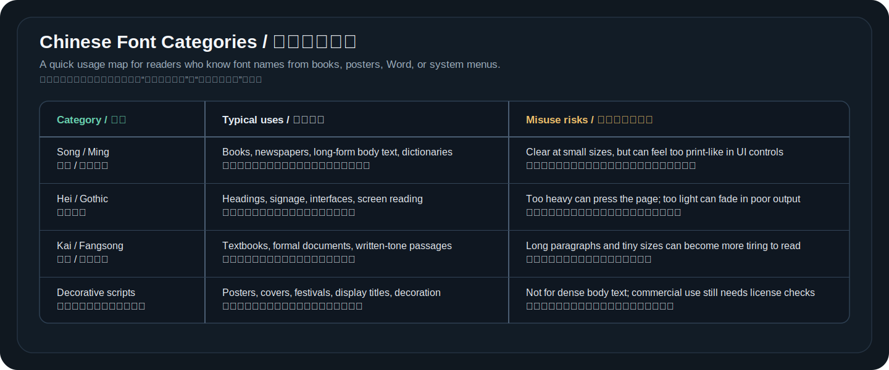

# 那些熟悉的字体从哪里来

字体科普很容易停在抽象概念里。真正建立感觉，还是要看具体字体：它为什么出现，用在什么地方，解决了什么问题，又为什么会被普通人记住。

这一篇不评价“哪个字体高级”。它只看三个问题：需求从哪里来，字体怎样回应这个需求，它又通过什么渠道进入大众视野。

读字体案例时，最有用的不是背名字，而是看它和市场、媒介、系统默认值之间的关系。同一套字形，如果只停在设计师电脑里，不会变成大众记忆；它必须进入报纸、书籍、操作系统、Office、网页、手机 UI、开源仓库或商业授权链路，才会被大量读者反复看见。

## 工具书和大型出版需要宋一体、黑一体

宋一体、黑一体、宋二体、黑二体是没有计算机的年代设计出来的现代中文印刷字体代表。中国近现代新闻出版博物馆的资料提到，上海印刷技术研究所是我国现代汉字印刷字体的重要发源地，并列出宋一体、黑一体、宋二体等代表作。

这些字体最值得学习的地方，不是它们“老”，而是它们都有明确任务。

宋一体和黑一体服务《辞海》这样的工具书排印。工具书字号小、信息密度高、翻阅频繁，正文字必须在小尺寸里保持清晰，黑体配套字必须能承担标题和检索提示。宋二体、黑二体服务横排本出版，又要适应新的排版方向和大规模印刷。

字体设计在这里不是自由创作，而是出版工程。它要处理字数、字号、纸张、油墨、正文、标题、检索、阅读疲劳和生产周期。

工具书还会放大字体的小问题。普通小说里偶尔有一个复杂字发黑，读者也许不会注意；辞书里密密麻麻都是小字、注释、引文、页码和检索信息，任何黑度不均、重心不稳、字面过小都会影响查阅效率。宋一体这类字体的价值就在这里：它不是为了单个标题惊艳，而是为了让整本书在高密度阅读里保持秩序。

## 书写感也会被印刷系统重新组织

“宋体”“楷体”“仿宋”既可以指字体风格，也可以指系统里的具体字体文件。这个区别很重要。

宋体作为风格，通常和横细竖粗、三角形收笔、书籍正文阅读有关。系统里的 SimSun 则是具体字体。Microsoft Learn 的 [SimSun & NSimSun](https://learn.microsoft.com/en-us/typography/font-list/simsun) 页面把它描述为简体中文 serif / mincho 风格字体，并列出 Windows 2000、Windows XP、Windows 7 等系统供应情况。

楷体和仿宋也类似。楷体保留更多书写感，常见于教材、儿童读物或需要柔和正式感的场景；仿宋常见于机关公文和正式材料。它们不是“比宋体更艺术”的替代品，而是服务不同阅读语气。

新魏、隶书、魏碑、行楷这类风格则更常用于标题、封面、宣传和装饰。它们的来源往往不是长文正文，而是版面需要更多层级和个性。印刷系统把书法传统、美术字经验和出版需求重新组织成可复用字体。

这也解释了为什么很多书法风格字体不适合正文。它们可以让标题有气质，让海报有记忆点，让节日、学校、宣传和装饰场景更有语气；但如果拿来排几千字正文，笔画变化、字面不均和风格强度反而会增加阅读负担。字体选择首先是场景判断，不是风格越强越好。

可以把常见中文字体先按用途粗略分开。这里说的是阅读场景，不是授权建议：

## 普通用户从系统字体菜单认识风格字体

很多中国用户第一次意识到“字体可以有性格”，不是在字体设计课上，而是在 Word、WPS 或系统字体菜单里。

姚体、华文彩云、魏碑、新魏、隶书、行楷这类字体让用户看到：字体可以是标题，可以是装饰，可以带书法气质，也可以用于海报和作业封面。它们的价值不在于适合长文阅读，而在于让普通人理解“字体风格会改变文本语气”。

这类字体也提醒一件事：能在系统里选到，不等于适合所有场景。正文阅读、标题设计、海报装饰、商业使用和软件再分发，对字体的要求完全不同。

系统字体菜单还制造了另一种误会：用户会把“我电脑里有”理解成“我可以随便用”。实际上，字体安装、文档显示、商业授权、网页嵌入、App 打包、印刷输出和再分发是不同问题。很多字体可以在本机软件里正常显示，但不能直接打包进项目，也不能随产品发布。这一点对开发者尤其重要。

## Times New Roman 来自报纸的高密度正文

[Microsoft Learn 的 Times New Roman 页面](https://learn.microsoft.com/en-us/typography/font-list/times-new-roman)记录了它最早在 1932 年用于 The Times of London，由 Stanley Morison 指导、Victor Lardent 绘制，并由 Monotype 继续完善。

Times New Roman 的典型意义是“高信息密度下的正文阅读”。它和报纸版面、窄栏、纸面印刷、经济用纸都有关系。后来它随 Windows、Office 和学校文档规范进入大众记忆，成为很多人心里的“正式文档字体”。

它说明一个道理：字体的流行不只来自字形本身，也来自发行渠道和默认设置。

报纸字体通常要在有限宽度里放下更多文字，同时保持可读性。Times New Roman 的字宽、衬线、字母比例和节奏都服务这种现实约束。后来它进入办公软件默认环境后，读者对它的感受又发生变化：从报纸字体变成论文、合同、学校作业和正式文件的常见面孔。字体的意义会被使用渠道重新塑造。

## Helvetica 和 Arial 背后有平台和授权

Helvetica 诞生于瑞士现代主义语境。Adobe Fonts 的 [Max Miedinger 页面](https://fonts.adobe.com/designers/max-miedinger)提到，Miedinger 以 1957 年创造 Neue Haas Grotesk、后来改名 Helvetica 而知名。Helvetica 的关键词是中性、清晰、现代、标识系统。

Arial 则和 Microsoft 生态更紧密。[Microsoft Learn 的 Arial 页面](https://learn.microsoft.com/en-us/typography/font-list/arial)列出设计者 Robin Nicholas、Patricia Saunders 和 1982 年的 Monotype Type Drawing Office 信息，并显示它从 Windows 3.1 起进入 Microsoft 产品。

很多人把 Arial 和 Helvetica 的关系讲成审美争论，但更适合程序员理解的角度是平台和授权。一个字体能成为默认字体，常常和操作系统、打印机、软件授权、文档兼容有关。

Helvetica 的成功和现代标识系统、企业视觉、交通导视、海报和国际主义平面设计有关；Arial 的广泛出现则和 Microsoft 生态、文档兼容和跨平台替代关系有关。它们说明同一种视觉方向可能通过不同路径进入世界：一条来自设计史和品牌系统，一条来自软件平台和授权分发。

## Comic Sans MS 原本是为轻松语境准备的

Comic Sans MS 经常被拿来开玩笑，但它不是凭空出现的“坏字体”。[Microsoft Learn 的 Comic Sans MS 页面](https://learn.microsoft.com/en-us/typography/font-list/comic-sans-ms)记录了设计者 Vincent Connare 的说明：它来自 1994 年 Microsoft 对漫画风格软件和趣味字体的需求，后来随 Windows 95 Plus!、IE 等进入用户环境。

Comic Sans 的问题通常不是“它不能用”，而是“它被用在了不合适的场景”。它适合轻松、儿童、漫画气质的文本；如果放进严肃公文、法律声明或企业报告，就会造成语气错位。

这个例子很适合说明字体设计的基本原则：字体没有脱离场景的绝对好坏，只有是否匹配内容、媒介和读者预期。

它也说明默认分发的力量。一个字体只要进入系统和浏览器，普通用户就能在无数场景里选择它。设计师原本设想的语境会被放大、迁移、误用。现代字体设计因此不能只考虑字形本身，也要考虑它会被放进什么软件、被什么人看到、是否容易被误读。

## 微软雅黑回应的是中文屏幕阅读

微软雅黑是很多中国用户进入 Windows Vista / Windows 7 时代后的重要屏幕字体记忆。[Microsoft Learn 的 Microsoft YaHei 页面](https://learn.microsoft.com/en-us/typography/font-list/microsoft-yahei)说明它是面向简体中文、利用 ClearType 技术开发的字体，适合小尺寸屏幕阅读；页面也列出 Windows Vista、Windows 7、Windows 10、Windows 11 等供应信息。

微软雅黑的意义在于：中文系统字体开始明显为屏幕优化。它不像宋体那样带有强烈纸面印刷气质，而是让 UI、菜单、网页和屏幕正文更接近现代界面需求。

中文屏幕字体要处理的问题比西文更重。一个汉字内部有更多笔画和更复杂空间，小字号里横画、竖画、撇捺、点和内部空白容易糊在一起。微软雅黑这类字体的意义，不只是“看起来更现代”，而是让中文在 LCD 屏幕、菜单、网页正文和办公界面里更稳定。

## 等线和苹方来自新的界面默认值

等线（DengXian）出现在许多 Windows 10 和 Office 用户的日常里。[Microsoft Learn 的 DengXian 页面](https://learn.microsoft.com/en-us/typography/font-list/dengxian)说明它随 Windows 10 简体中文补充字体包引入，并列出 Light、Regular、Bold 三个字重；Microsoft 支持文档 [Add East Asian fonts in Windows 10 for use with Office documents](https://support.microsoft.com/en-au/office/add-east-asian-fonts-in-windows-10-for-use-with-office-documents-d3db3730-3674-4a53-bfb9-1a8533524fba) 也提到 Office 2016 简体中文版的默认字体变为 Dengxian。

Apple 的 [System Fonts](https://developer.apple.com/fonts/system-fonts/?q=pingfang) 页面列出了 PingFang SC、PingFang TC、PingFang HK 等字族在 Apple 平台中的供应状态。对普通用户来说，苹方的意义是 macOS、iOS 等系统里的中文界面体验变得更统一。

系统字体和文档字体不同。系统字体要服务按钮、列表、设置页、通知、App UI 和多语言混排。它必须在不同屏幕、不同字号、不同界面密度里稳定工作。

等线和苹方体现了界面字体的另一个方向：更轻、更中性、更适合多层级 UI。界面里一个字可能出现在导航、按钮、标签、设置项、通知、搜索结果和输入框里，字号跨度很大，背景颜色也不断变化。系统字体要能在这些环境里保持统一，不抢内容本身的注意力。

## 思源系列说明字体也可以像大型开源项目

思源黑体和思源宋体是现代开源字体协作的重要例子。Adobe 的 [Source Han Sans](https://github.com/adobe-fonts/source-han-sans) 仓库说明它是一套 OpenType Pan-CJK 字体，并提供构建这些字体所需的源码文件；[Source Han Serif](https://github.com/adobe-fonts/source-han-serif) 仓库也采用类似方式说明源码和构建。

它们同时对应 Google 的 Noto CJK 体系，解决的是中日韩多地区、多字形、多语言覆盖问题。对程序员来说，思源系列最有启发的是“字体可以像大型开源项目一样协作”：有源码、有构建、有 release、有许可、有地区差异和 issue 反馈。

这和 Ligconsolata Next 的小项目形成尺度对比。一个是 Pan-CJK 大型字体工程，一个是在 Inconsolata 上补编程连字的小 fork；但它们都说明同一件事：现代字体已经是软件工程的一部分。

思源系列还让“同一个汉字在不同地区可能有不同字形习惯”这个问题变得可见。简体中文、繁体中文、日本汉字和韩国汉字共享大量 Unicode 码位，但实际字形规范和读者习惯并不完全一样。Pan-CJK 字体项目要同时处理覆盖范围、地区字形、OpenType 行为、文件体积、构建流程和开源授权。它不是单纯画出一套漂亮汉字，而是在多个语言环境之间建立可维护系统。

## 继续阅读

- Microsoft Learn: [SimSun & NSimSun](https://learn.microsoft.com/en-us/typography/font-list/simsun)
- Microsoft Learn: [Times New Roman](https://learn.microsoft.com/en-us/typography/font-list/times-new-roman)
- Microsoft Learn: [Arial](https://learn.microsoft.com/en-us/typography/font-list/arial)
- Microsoft Learn: [Comic Sans MS](https://learn.microsoft.com/en-us/typography/font-list/comic-sans-ms)
- Microsoft Learn: [Microsoft YaHei](https://learn.microsoft.com/en-us/typography/font-list/microsoft-yahei)
- Microsoft Learn: [DengXian](https://learn.microsoft.com/en-us/typography/font-list/dengxian)
- Microsoft Support: [Add East Asian fonts in Windows 10 for use with Office documents](https://support.microsoft.com/en-au/office/add-east-asian-fonts-in-windows-10-for-use-with-office-documents-d3db3730-3674-4a53-bfb9-1a8533524fba)
- Apple Developer: [System Fonts](https://developer.apple.com/fonts/system-fonts/?q=pingfang)
- Adobe Fonts: [Max Miedinger](https://fonts.adobe.com/designers/max-miedinger)
- Adobe Fonts GitHub: [Source Han Sans](https://github.com/adobe-fonts/source-han-sans), [Source Han Serif](https://github.com/adobe-fonts/source-han-serif)
