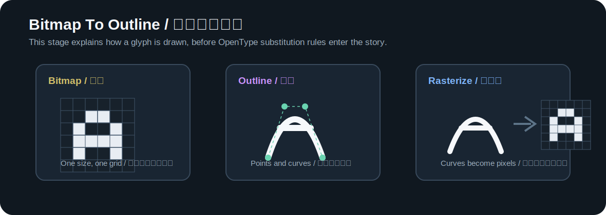

# 字体从像素格走向轮廓

计算机出现后，字体从纸和铅进入屏幕。屏幕最早没有今天这么细腻，字形也不能一开始就靠复杂轮廓实时渲染。数字字体的发展，先从点阵开始，再进入轮廓、hinting、TrueType 和 OpenType 容器。

这一篇只讲字形怎样从点阵走到曲线。连字、GSUB 和替换规则放到后面的单独章节里，因为那是“显示时怎样换 glyph”的问题，不是“一个 glyph 怎样被画出来”的问题。

## 点阵字体把每个字画进小格子

点阵字体可以理解为一张小格子图。一个 16x16 的汉字，就是 256 个格子决定哪些点亮、哪些不亮。拉丁字母也一样，只是占用格子更少。

早期屏幕分辨率低，处理能力有限，点阵字体非常直接。系统不需要实时计算复杂曲线，只要把预先设计好的像素阵列贴到屏幕上。每个像素是开还是关，边界在哪里，横画占几个像素，竖画占几个像素，都由字模决定。

点阵字体的优点很直接：

- 低分辨率屏幕上清楚。
- 显示速度快。
- 字形边界可控，不依赖复杂渲染器。

缺点也同样明显：

- 换字号就要重新设计一套点阵。
- 放大会出现锯齿。
- 曲线和细节受格子限制。
- 中文字数多，维护多尺寸点阵成本很高。

这和铅活字有相似处。铅活字每个字号都有对应字粒；点阵字体每个像素尺寸也需要对应字模。媒介变了，“目标尺寸决定字形”的问题仍然存在。

点阵字体还有一个很现实的取舍：它牺牲连续缩放，换来特定尺寸的清楚。一个 12px 点阵字如果设计得好，在 12px 屏幕上会非常利落；但把它放大到 48px，就会看到明显方块。反过来，如果只用高分辨率轮廓缩小到 12px，笔画可能落不到像素格上，反而发灰、发糊。字体显示一直是在“几何正确”和“像素清楚”之间找平衡。

## 轮廓字体把字形变成可缩放几何

轮廓字体把字形从固定像素格里解放出来。一个 glyph 由轮廓点、曲线和方向组成，渲染器根据字号把轮廓栅格化成屏幕像素。

这一步让同一个字形可以被放大到标题，也可以缩小到正文。字体设计者不再为每个字号画一张像素图，而是维护一个可缩放的轮廓。

轮廓字体的核心不是“无限清晰”。它只是把字形描述从像素网格换成几何轮廓。真正显示时，仍然要落回像素，所以小字号下仍会遇到笔画糊、横竖不齐、曲线锯齿、黑白不均等问题。

轮廓字体的优势是维护入口变了。设计者可以维护一套轮廓，让它在不同尺寸下被渲染器计算；不必为每个字号重新画完整点阵。但中文字体仍然会遇到大量字形质量问题：复杂字缩小后内部空间不够，细横画容易消失，粗笔画容易粘连，标点和西文混排时高度不协调。这些问题不会因为使用轮廓格式自动消失。

## 贝塞尔曲线用少量控制点画平滑轮廓

贝塞尔曲线是一种用控制点描述曲线的方法。设计者不需要记录曲线上的每一个点，只要记录起点、终点和控制点，渲染器就能计算出平滑曲线。

Microsoft OpenType 规范的 [`glyf` 表](https://learn.microsoft.com/en-us/typography/opentype/spec/glyf)说明，TrueType glyph 描述用点来定义轮廓，其中会涉及 on-curve 和 off-curve 点。简单理解，on-curve 点在轮廓上，off-curve 点负责控制曲线方向。

字体设计里常见两类轮廓：

- TrueType `glyf` 轮廓常用二次贝塞尔曲线。
- PostScript / CFF 轮廓常用三次贝塞尔曲线。

普通读者不需要马上掌握数学细节，只要知道：现代字体不是保存“字的图片”，而是保存可缩放、可计算的字形轮廓。

对开发者来说，曲线还有一个重要含义：字体文件里的字形可以被程序读取、变换和生成。Ligconsolata Next 生成连字时，不是在图片软件里拼贴截图，而是移动、组合和调整 glyph 的轮廓点。只要轮廓和 metrics 写回源码，后续就能重新构建字体、检查宽度、生成 SVG specimen。

## Hinting 帮小字号贴住像素

轮廓可以缩放，但屏幕是像素组成的。一个横画如果正好落在两个像素之间，就可能显得发虚；一个竖画如果宽度不到一个像素，就可能忽隐忽现。

Hinting 的作用，是在小字号和低分辨率场景下帮助轮廓更好地贴合像素网格。它不是改变字形设计，而是给渲染器更多提示，让文字显示更清楚。

这也是为什么同一个字体在不同系统、不同浏览器、不同屏幕上可能看起来不一样。字体文件提供轮廓和提示，渲染器决定最终怎样变成像素。

抗锯齿和次像素渲染也是这一层的问题。抗锯齿会用灰度像素软化边缘，让曲线不再像硬台阶；ClearType 这类技术会利用 LCD 子像素结构改善横向清晰度。它们让屏幕文字更平滑，但也会改变字的黑度和边缘感觉。字体设计师和开发者不能只看 outline，还要看最终渲染。

## TTF 和 OTF 是给系统消费的字体文件

TTF 和 OTF 是常见字体文件格式。它们适合安装、分发和被应用程序读取，但不适合作为长期手工维护入口。

TrueType 字体通常使用 `glyf` 表保存轮廓；OpenType 是更大的容器规范，可以包含 TrueType flavor，也可以包含 CFF / CFF2 flavor。日常看到 `.ttf` 和 `.otf` 时，不要简单理解成“一个是旧格式，一个是新格式”。更准确的说法是：它们是可以被系统和应用消费的字体二进制文件，里面保存轮廓、metrics、cmap、name 等表。

源码层则可能是 `.glyphs`、UFO、Designspace、FontLab 工程文件、AFDKO 源文件或项目自己的脚本和配置。源码里通常保留更多设计信息和构建信息，适合长期维护。

这里可以把字体文件想成编译后的包。`cmap` 负责把字符码位映射到 glyph，`name` 保存字体家族和样式名称，metrics 决定排版宽度和高度，轮廓表保存字形几何。应用程序安装和加载的是这个包；设计者长期维护的，通常是更上游的源码格式和构建脚本。

## 程序员为什么要懂这一层

改字体时，如果直接打开 TTF/OTF 改，像是在改编译产物。能改，但不适合作为项目主线。更稳的方式是改源码，重新构建，再检查输出字体。

Ligconsolata Next 的做法也是这样：先改 `sources/Inconsolata.glyphs` 和生成脚本，再构建临时 TTF，用工具、SVG specimen 和 HTML demo 验证效果。最终用户安装的是字体文件，开发者维护的是源码和构建链路。

这和软件工程完全一致：源码是权威入口，构建产物用于运行和验证。

## 继续阅读

- Microsoft Learn: [OpenType font file](https://learn.microsoft.com/en-us/typography/opentype/spec/otff)
- Microsoft Learn: [glyf table](https://learn.microsoft.com/en-us/typography/opentype/spec/glyf)
- Microsoft Learn: [TrueType overview](https://learn.microsoft.com/en-us/typography/truetype/)
