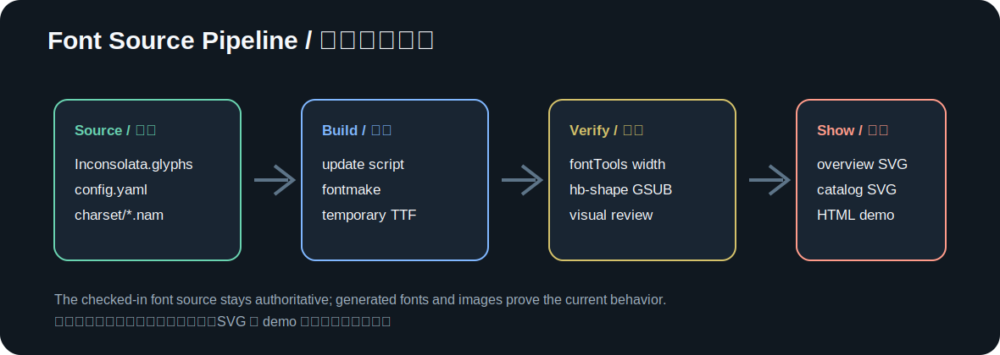
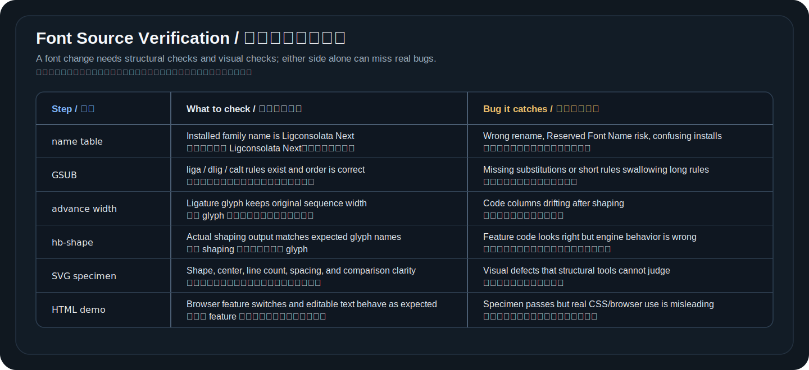

# 字体源码藏在哪些文件里

理解了活字、点阵、轮廓、可变字体和 OpenType 替换规则之后，再看 Inconsolata 这个仓库，就不会只看到一堆陌生文件。

现代字体项目和普通软件项目很像：有源码，有配置，有脚本，有构建产物，也有用于人工 review 的展示页面。



## `fonts/` 里放的是构建产物

`fonts/` 目录里的 TTF/OTF 文件更像 release artifact。它们适合安装、测试和发布，但不应该作为主要编辑入口。

直接改二进制字体有两个问题。第一，修改记录不透明，review 难度高；第二，很多设计和构建信息已经被压成字体表，后续维护不方便。就像普通程序不应该把编译后的二进制当源码改，字体项目也不应该把生成出来的 TTF 当权威来源。

这并不是说构建产物不重要。字体最终要被系统、编辑器和浏览器加载，验证时必须看真实 TTF/OTF。区别在于：发现问题后应该回到源码和生成脚本修，而不是在产物里临时打补丁。否则下一次构建会把手工改动覆盖掉，项目也很难 review 到底改了什么。

## `sources/Inconsolata.glyphs` 是主要字体源码

Glyphs Handbook 的 [Source Formats](https://handbook.glyphsapp.com/source-formats/) 说明，Glyphs 文件是 Glyphs App 的源文件格式，一个 `.glyphs` 文件可以保存字体项目的信息。

在这个仓库里，`sources/Inconsolata.glyphs` 是最重要的源码文件。它保存了：

- family name 和字体基本信息。
- master 和轴相关信息。
- glyph 名称和 Unicode 映射。
- 轮廓、组件和 metrics。
- OpenType feature，例如 `dlig`、`liga`、`calt`。
- 构建时需要保留的参数和元数据。

Ligconsolata Next 改 family name、补连字 glyph、同步 `liga` / `dlig`、增加 `calt` 上下文规则，最终都要落到这个文件里。

`.glyphs` 文件里的 glyph 不只是轮廓。它还保存每个 glyph 的宽度、左右边距、组件引用、不同 master 的形态、OpenType feature 和导出设置。一个连字看起来只是多了一个符号，实际上会牵动 glyph 数据、feature 替换规则、可变字体 master 和最终构建产物。

## `sources/config.yaml` 告诉构建工具怎样输出

`sources/config.yaml` 是 Google Fonts 构建链路的配置入口。它告诉构建工具：

- 源文件是 `Inconsolata.glyphs`。
- family name 是什么。
- 轴顺序是什么。
- 是否构建 static 字体。
- 哪些输出参与发布。

Ligconsolata Next 里可以看到 `wdth` 和 `wght` 两条轴。它们不是文档里的装饰词，而是构建产物和可变字体行为的一部分。

这个配置还决定了构建工具怎样理解项目。源码文件里有很多信息，但构建系统需要知道入口、轴顺序、输出文件和发布策略。对 fork 项目来说，family name、输出路径和构建参数尤其敏感：名字没有改干净，用户安装时就可能和上游 Inconsolata 混在一起。

## `sources/charset/*.nam` 更像字符集清单

`.nam` 文件容易让人误解。它不是通用意义上的字体源码格式，也不是保存轮廓的地方。

在这个仓库里，`sources/charset/*.nam` 更像字符集和 glyph 清单。打开文件可以看到类似这样的内容：

```text
0x0021 ! exclam
0x003D = equal
```

前面是 Unicode 码位，中间是字符，后面是 glyph name。也有一些行只记录 glyph name，用于列出不直接对应普通字符的内部 glyph。

这类文件的价值是说明覆盖范围和命名关系。它帮助构建、检查和维护字库范围，但真正的 outline 和 feature 仍然在 `.glyphs` 源码里。

`.nam` 文件适合回答“这个项目打算覆盖哪些字符和 glyph”，不适合回答“这个字长什么样”。如果新增一个有 Unicode 的字符，清单和映射就很重要；如果新增的是内部连字 glyph，它可能没有独立 Unicode，只通过 OpenType feature 被调用。理解这一点，才能区分字符、glyph 和连字 glyph。

## `scripts/update-ligature-glyphs.py` 把重复设计写成规则

编程连字里有大量重复结构。比如 `==>`、`<==`、`|===>`、`<===|` 都可以拆成等号、箭头端点、竖线端点和中间段。

如果每个 glyph 都手画，结果很容易不一致。脚本的作用是把可重复规则固化下来：

- 从已有 Inconsolata glyph 中取笔画和轮廓。
- 按目标宽度平移、组合或缩放。
- 写入新的 ligature glyph。
- 同步更新 `liga`、`dlig` 和 `calt` feature。

脚本不替代审美判断。它只保证规则可重复。生成后仍然要看宽度、shaping 和真实视觉效果。

这类脚本最适合处理重复结构。比如长箭头可以拆成 start、middle、end，连续下划线可以拆成开头、中段和结尾，`==>` / `<==` 可以复用等号和箭头端点。脚本能让这些 glyph 的宽度、命名和 feature 顺序保持一致。它不能自动判断某个斜线是不是太靠上，某个等号是不是看起来像三条横线，这些仍然需要 specimen 和人工 review。

## specimen 和 demo 是字体项目里的视觉测试

普通单元测试可以判断函数输出，字体还需要视觉测试。

Ligconsolata Next 里有两类展示：

- `documentation/img/ligconsolata-next-overview.svg`：README 顶部的代表性对比图。
- `documentation/img/ligconsolata-next-ligature-catalog.svg`：更完整的视觉目录。
- `documentation/demo/index.html`：浏览器里的真实字体对比 demo。

这些展示不是手绘图。它们应该来自实际构建出来的字体，通过 `hb-shape` 或浏览器渲染确认真实行为。这样才能避免把 `=>` 偷换成 `⇒`，也能让 `==` / `===`、`!=` / `!==` 这类问题暴露出来。

字体项目的视觉测试和普通截图不一样。一个 specimen 如果直接用 SVG path 手画，只能证明“我们希望它这样”，不能证明字体文件真的这样。Ligconsolata Next 的展示配置写 raw ASCII，脚本构建临时字体，再把 shaping 后的 glyph 画出来。这样图片本身就是一份 QA 证据。

## 一条完整字体工程链路

Ligconsolata Next 当前比较稳的链路是：

1. 修改 `scripts/update-ligature-glyphs.py` 或 `.glyphs` 源码。
2. 运行脚本更新 glyph 和 feature。
3. 用 `fontmake` 构建临时字体，不覆盖发布产物。
4. 用 `fontTools` 检查 name table、GSUB 和 advance width。
5. 用 `hb-shape` 检查真实替换结果。
6. 重新生成 SVG specimen。
7. 打开 HTML demo 看真实浏览器效果。
8. 只把已经验证过的能力写进 README。

这就是“字体作为源码”的核心意义。字体不再是一个神秘二进制文件，而是一组可以修改、构建、检查、展示和 review 的工程资产。

这条链路也解释了为什么 AGENTS.md 要记录项目约束。字体改动很容易跨越设计、脚本、构建、展示和文档；上下文一旦压缩，新的 Agent 如果只看某个脚本，很容易忘记宽度、命名、Fira Code 边界和 README 口径。把这些规则写进仓库，是为了让后续每次改动都能回到同一套判断标准。

每一步能抓到的问题也不同。字体项目不能只靠命令，也不能只靠肉眼看图：



字体项目的验证不是一条命令能完成。命令检查能抓结构错误，图和 demo 能抓视觉错误，两者缺一边都容易漏问题。

## 继续阅读

- Glyphs Handbook: [Source Formats](https://handbook.glyphsapp.com/source-formats/)
- Glyphs Handbook: [Exporting Font Files](https://handbook.glyphsapp.com/export/)
- Microsoft Learn: [OpenType font file](https://learn.microsoft.com/en-us/typography/opentype/spec/otff)
- Ligconsolata Next: [连字迁移复盘](../ligature-porting-notes.md)
