# Ligconsolata Next Feature Gallery

This gallery is generated from the current Ligconsolata Next source and the local demo font. Each image renders the same sample text twice: the left side uses Ligconsolata Next shaping, and the right side keeps raw ASCII glyphs.

这份图库由当前 Ligconsolata Next 源码和本地 demo 字体生成。每张图都会把同一段样例渲染两遍：左侧是 Ligconsolata Next 连字结果，右侧是原始 ASCII。

Each feature image contains its own bilingual title, summary, and notes. The text below each image is kept for direct playground links and copyable samples only, so the same explanation is not repeated in two places.

每张功能图内部都包含双语标题、摘要和说明。图片下方只保留可直接打开 Playground 的链接和可复制样例，避免同一段解释在图内外重复出现。

## OpenType Feature Map

| Feature | Role / 作用 | Notes / 说明 |
| --- | --- | --- |
| `liga` | Default fixed programming ligatures / 默认固定编程连字 | Most short operators and safe fixed forms are available here. / 多数短操作符和安全固定组合放在这里。 |
| `calt` | Contextual behavior / 上下文行为 | Long arrows, hash runs, numeric `x`, punctuation alignment, guards, and thin backslash. / 长箭头、井号 run、数字 `x`、标点对齐、保护规则和细反斜杠放在这里。 |
| `dlig` | Compatibility mirror / 兼容镜像 | Kept for Inconsolata / Ligconsolata history, but the default editor story is `liga + calt`. / 保留历史兼容；默认编辑器路径仍是 `liga + calt`。 |
| glyph width fix | Non-GSUB punctuation fix / 非 GSUB 标点修正 | U+2014 `emdash` and U+2015 `horizontalbar` are widened for CJK dash continuity. / U+2014 和 U+2015 加宽以适配中文破折号连续性。 |

The built font also contains inherited upstream typographic feature tags. They are present in the font, but they are not the main Ligconsolata Next coding-ligature gallery:

构建产物里也包含上游继承的排版 feature tag。它们存在于字体中，但不是这份 Ligconsolata Next 编码连字图库的重点。

`aalt` `calt` `case` `ccmp` `dlig` `dnom` `frac` `liga` `locl` `numr`
`ordn` `salt` `ss01` `ss02` `ss03` `subs` `sups` `zero`

## Feature Panels

### Core Equality And Comparison / 核心相等与比较

Tags: `liga`, `calt`

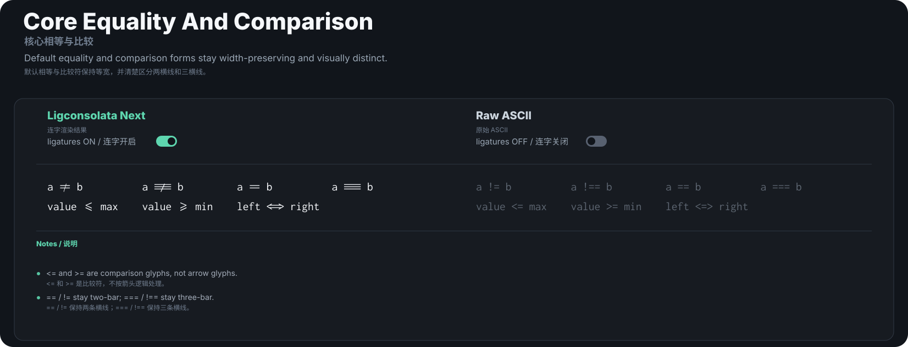

Samples / 样例: [Open in playground / 在 Playground 打开](demo/index.html?sample=a%20%21%3D%20b%0Aa%20%21%3D%3D%20b%0Aa%20%3D%3D%20b%0Aa%20%3D%3D%3D%20b%0Avalue%20%3C%3D%20max%0Avalue%20%3E%3D%20min%0Aleft%20%3C%3D%3E%20right)

```text
a != b
a !== b
a == b
a === b
value <= max
value >= min
left <=> right
```

### Common Operators / 常用操作符

Tags: `liga`

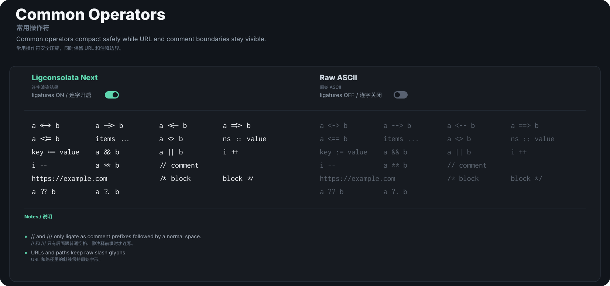

Samples / 样例: [Open in playground / 在 Playground 打开](demo/index.html?sample=a%20%3C-%3E%20b%0Aa%20--%3E%20b%0Aa%20%3C--%20b%0Aa%20%3D%3D%3E%20b%0Aa%20%3C%3D%3D%20b%0Aitems%20...%0Aa%20%3C%3E%20b%0Ans%20%3A%3A%20value%0Akey%20%3A%3D%20value%0Aa%20%26%26%20b%0Aa%20%7C%7C%20b%0Ai%20%2B%2B%0Ai%20--%0Aa%20%2A%2A%20b%0A%2F%2F%20comment%0Ahttps%3A%2F%2Fexample.com%0A%2F%2A%20block%0Ablock%20%2A%2F%0Aa%20%3F%3F%20b%0Aa%20%3F.%20b)

```text
a <-> b
a --> b
a <-- b
a ==> b
a <== b
items ...
a <> b
ns :: value
key := value
a && b
a || b
i ++
i --
a ** b
// comment
https://example.com
/* block
block */
a ?? b
a ?. b
```

### Fira Code Inspired Fixed Operators / Fira Code 灵感固定操作符

Tags: `liga`

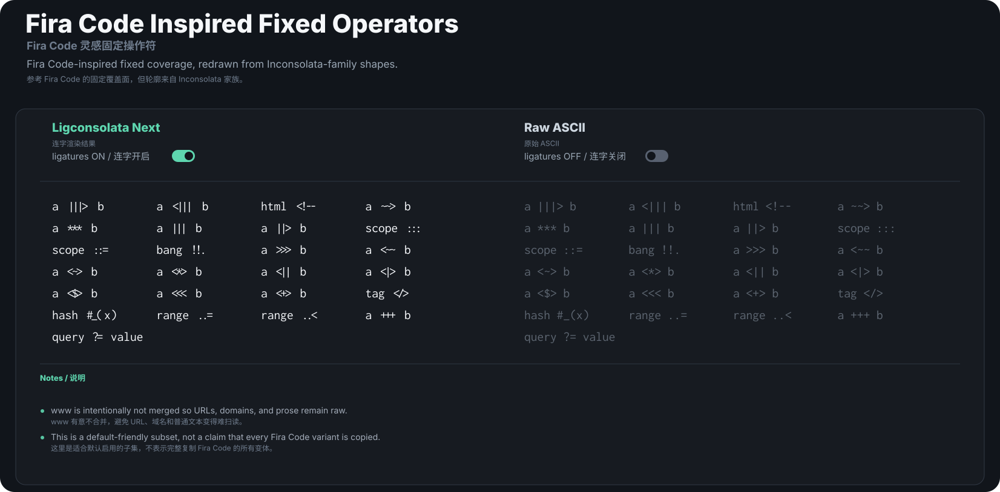

Samples / 样例: [Open in playground / 在 Playground 打开](demo/index.html?sample=a%20%7C%7C%7C%3E%20b%0Aa%20%3C%7C%7C%7C%20b%0Ahtml%20%3C%21--%0Aa%20~~%3E%20b%0Aa%20%2A%2A%2A%20b%0Aa%20%7C%7C%7C%20b%0Aa%20%7C%7C%3E%20b%0Ascope%20%3A%3A%3A%0Ascope%20%3A%3A%3D%0Abang%20%21%21.%0Aa%20%3E%3E%3E%20b%0Aa%20%3C~~%20b%0Aa%20%3C~%3E%20b%0Aa%20%3C%2A%3E%20b%0Aa%20%3C%7C%7C%20b%0Aa%20%3C%7C%3E%20b%0Aa%20%3C%24%3E%20b%0Aa%20%3C%3C%3C%20b%0Aa%20%3C%2B%3E%20b%0Atag%20%3C%2F%3E%0Ahash%20%23_%28x%29%0Arange%20..%3D%0Arange%20..%3C%0Aa%20%2B%2B%2B%20b%0Aquery%20%3F%3D%20value)

```text
a |||> b
a <||| b
html <!--
a ~~> b
a *** b
a ||| b
a ||> b
scope :::
scope ::=
bang !!.
a >>> b
a <~~ b
a <~> b
a <*> b
a <|| b
a <|> b
a <$> b
a <<< b
a <+> b
tag </>
hash #_(x)
range ..=
range ..<
a +++ b
query ?= value
```

### Fira Code Inspired Pairs / Fira Code 灵感双字符

Tags: `liga`

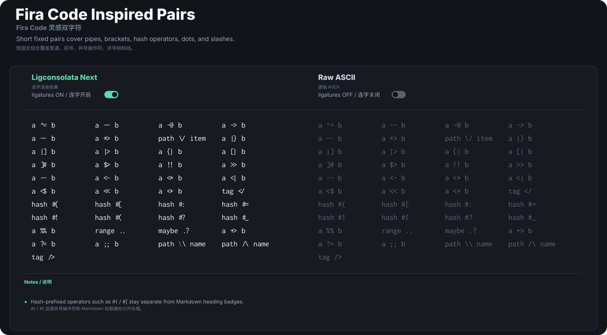

Samples / 样例: [Open in playground / 在 Playground 打开](demo/index.html?sample=a%20%5E%3D%20b%0Aa%20~~%20b%0Aa%20~%40%20b%0Aa%20~%3E%20b%0Aa%20~-%20b%0Aa%20%2A%3E%20b%0Apath%20%5C%2F%20item%0Aa%20%7C%7D%20b%0Aa%20%7C%5D%20b%0Aa%20%7C%3E%20b%0Aa%20%7B%7C%20b%0Aa%20%5B%7C%20b%0Aa%20%5D%23%20b%0Aa%20%24%3E%20b%0Aa%20%21%21%20b%0Aa%20%3E%3E%20b%0Aa%20-~%20b%0Aa%20%3C~%20b%0Aa%20%3C%2A%20b%0Aa%20%3C%7C%20b%0Aa%20%3C%24%20b%0Aa%20%3C%3C%20b%0Aa%20%3C%2B%20b%0Atag%20%3C%2F%0Ahash%20%23%7B%0Ahash%20%23%5B%0Ahash%20%23%3A%0Ahash%20%23%3D%0Ahash%20%23%21%0Ahash%20%23%28%0Ahash%20%23%3F%0Ahash%20%23_%0Aa%20%25%25%20b%0Arange%20..%0Amaybe%20.%3F%0Aa%20%2B%3E%20b%0Aa%20%3F%3D%20b%0Aa%20%3B%3B%20b%0Apath%20%5C%5C%20name%0Apath%20%2F%5C%20name%0Atag%20%2F%3E)

```text
a ^= b
a ~~ b
a ~@ b
a ~> b
a ~- b
a *> b
path \/ item
a |} b
a |] b
a |> b
a {| b
a [| b
a ]# b
a $> b
a !! b
a >> b
a -~ b
a <~ b
a <* b
a <| b
a <$ b
a << b
a <+ b
tag </
hash #{
hash #[
hash #:
hash #=
hash #!
hash #(
hash #?
hash #_
a %% b
range ..
maybe .?
a +> b
a ?= b
a ;; b
path \\ name
path /\ name
tag />
```

### Calt Inspired Fixed Forms / calt 灵感固定组合

Tags: `liga`, `dlig`

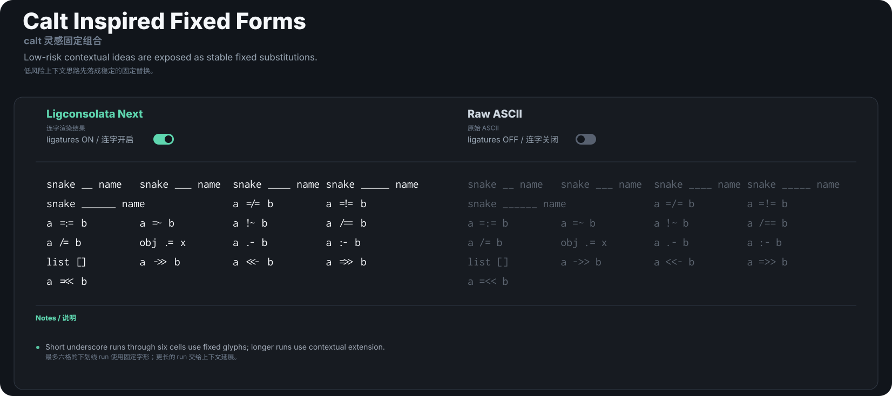

Samples / 样例: [Open in playground / 在 Playground 打开](demo/index.html?sample=snake%20__%20name%0Asnake%20___%20name%0Asnake%20____%20name%0Asnake%20_____%20name%0Asnake%20______%20name%0Aa%20%3D%2F%3D%20b%0Aa%20%3D%21%3D%20b%0Aa%20%3D%3A%3D%20b%0Aa%20%3D~%20b%0Aa%20%21~%20b%0Aa%20%2F%3D%3D%20b%0Aa%20%2F%3D%20b%0Aobj%20.%3D%20x%0Aa%20.-%20b%0Aa%20%3A-%20b%0Alist%20%5B%5D%0Aa%20-%3E%3E%20b%0Aa%20%3C%3C-%20b%0Aa%20%3D%3E%3E%20b%0Aa%20%3D%3C%3C%20b)

```text
snake __ name
snake ___ name
snake ____ name
snake _____ name
snake ______ name
a =/= b
a =!= b
a =:= b
a =~ b
a !~ b
a /== b
a /= b
obj .= x
a .- b
a :- b
list []
a ->> b
a <<- b
a =>> b
a =<< b
```

### Contextual Long Arrows / 上下文长箭头

Tags: `calt`

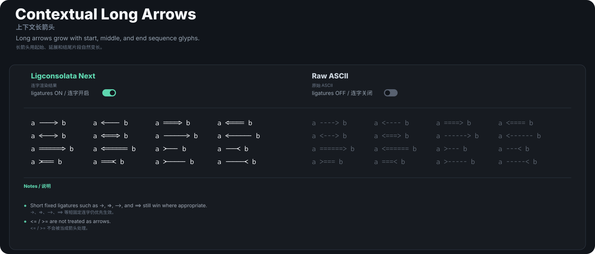

Samples / 样例: [Open in playground / 在 Playground 打开](demo/index.html?sample=a%20----%3E%20b%0Aa%20%3C----%20b%0Aa%20%3D%3D%3D%3D%3E%20b%0Aa%20%3C%3D%3D%3D%3D%20b%0Aa%20%3C---%3E%20b%0Aa%20%3C%3D%3D%3D%3E%20b%0Aa%20------%3E%20b%0Aa%20%3C------%20b%0Aa%20%3D%3D%3D%3D%3D%3D%3E%20b%0Aa%20%3C%3D%3D%3D%3D%3D%3D%20b%0Aa%20%3E---%20b%0Aa%20---%3C%20b%0Aa%20%3E%3D%3D%3D%20b%0Aa%20%3D%3D%3D%3C%20b%0Aa%20%3E-----%20b%0Aa%20-----%3C%20b)

```text
a ----> b
a <---- b
a ====> b
a <==== b
a <---> b
a <===> b
a ------> b
a <------ b
a ======> b
a <====== b
a >--- b
a ---< b
a >=== b
a ===< b
a >----- b
a -----< b
```

### Endpoint And Marker Runs / 端点与标记运行符

Tags: `liga`, `calt`

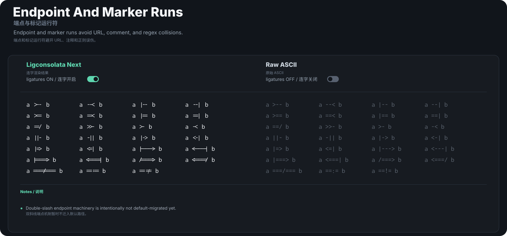

Samples / 样例: [Open in playground / 在 Playground 打开](demo/index.html?sample=a%20%3E--%20b%0Aa%20--%3C%20b%0Aa%20%7C--%20b%0Aa%20--%7C%20b%0Aa%20%3E%3D%3D%20b%0Aa%20%3D%3D%3C%20b%0Aa%20%7C%3D%3D%20b%0Aa%20%3D%3D%7C%20b%0Aa%20%3D%3D%2F%20b%0Aa%20%3E%3E-%20b%0Aa%20%3E-%20b%0Aa%20-%3C%20b%0Aa%20%7C%7C-%20b%0Aa%20-%7C%7C%20b%0Aa%20%7C-%3E%20b%0Aa%20%3C-%7C%20b%0Aa%20%7C%3D%3E%20b%0Aa%20%3C%3D%7C%20b%0Aa%20%7C---%3E%20b%0Aa%20%3C---%7C%20b%0Aa%20%7C%3D%3D%3D%3E%20b%0Aa%20%3C%3D%3D%3D%7C%20b%0Aa%20%2F%3D%3D%3D%3E%20b%0Aa%20%3C%3D%3D%3D%2F%20b%0Aa%20%3D%3D%3D%2F%3D%3D%3D%20b%0Aa%20%3D%3D%3A%3D%20b%0Aa%20%3D%3D%21%3D%20b)

```text
a >-- b
a --< b
a |-- b
a --| b
a >== b
a ==< b
a |== b
a ==| b
a ==/ b
a >>- b
a >- b
a -< b
a ||- b
a -|| b
a |-> b
a <-| b
a |=> b
a <=| b
a |---> b
a <---| b
a |===> b
a <===| b
a /===> b
a <===/ b
a ===/=== b
a ==:= b
a ==!= b
```

### Contextual Alignment / 上下文视觉对齐

Tags: `calt`

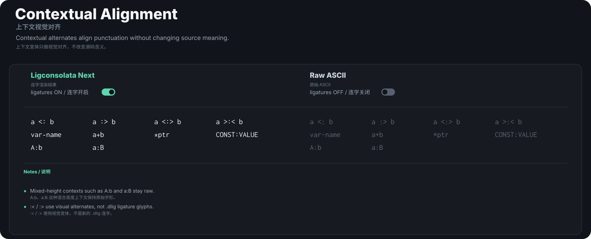

Samples / 样例: [Open in playground / 在 Playground 打开](demo/index.html?sample=a%20%3C%3A%20b%0Aa%20%3A%3E%20b%0Aa%20%3C%3A%3E%20b%0Aa%20%3E%3A%3C%20b%0Avar-name%0Aa%2Bb%0A%2Aptr%0ACONST%3AVALUE%0AA%3Ab%0Aa%3AB)

```text
a <: b
a :> b
a <:> b
a >:< b
var-name
a+b
*ptr
CONST:VALUE
A:b
a:B
```

### Numeric Contexts / 数字上下文

Tags: `calt`

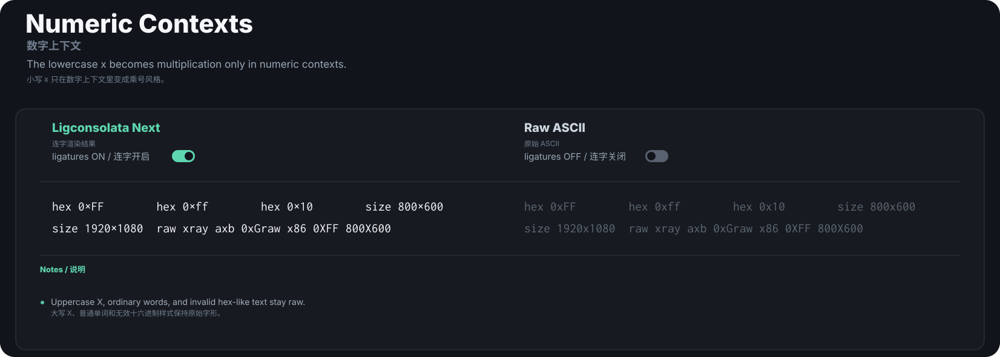

Samples / 样例: [Open in playground / 在 Playground 打开](demo/index.html?sample=hex%200xFF%0Ahex%200xff%0Ahex%200x10%0Asize%20800x600%0Asize%201920x1080%0Araw%20xray%20axb%200xG%0Araw%20x86%200XFF%20800X600)

```text
hex 0xFF
hex 0xff
hex 0x10
size 800x600
size 1920x1080
raw xray axb 0xG
raw x86 0XFF 800X600
```

### Markdown Hash Runs / Markdown 井号运行符

Tags: `calt`

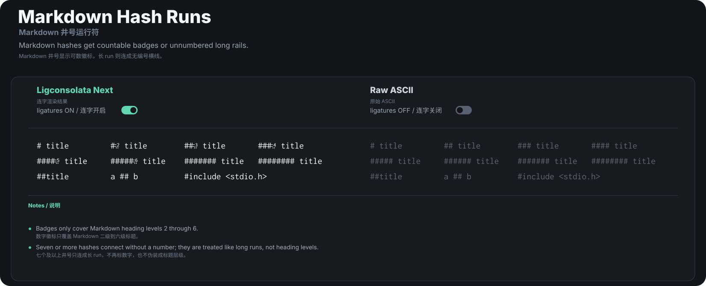

Samples / 样例: [Open in playground / 在 Playground 打开](demo/index.html?sample=%23%20title%0A%23%23%20title%0A%23%23%23%20title%0A%23%23%23%23%20title%0A%23%23%23%23%23%20title%0A%23%23%23%23%23%23%20title%0A%23%23%23%23%23%23%23%20title%0A%23%23%23%23%23%23%23%23%20title%0A%23%23title%0Aa%20%23%23%20b%0A%23include%20%3Cstdio.h%3E)

```text
# title
## title
### title
#### title
##### title
###### title
####### title
######## title
##title
a ## b
#include <stdio.h>
```

### Slash And Logic Guards / 斜线与逻辑符号保护

Tags: `liga`, `calt`

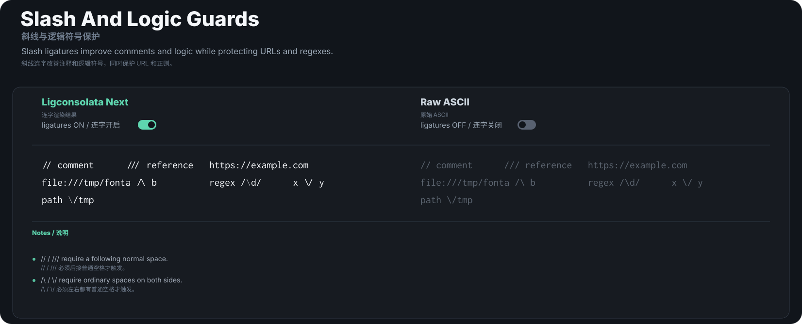

Samples / 样例: [Open in playground / 在 Playground 打开](demo/index.html?sample=%2F%2F%20comment%0A%2F%2F%2F%20reference%0Ahttps%3A%2F%2Fexample.com%0Afile%3A%2F%2F%2Ftmp%2Ffont%0Aa%20%2F%5C%20b%0Aregex%20%2F%5Cd%2F%0Ax%20%5C%2F%20y%0Apath%20%5C%2Ftmp)

```text
// comment
/// reference
https://example.com
file:///tmp/font
a /\ b
regex /\d/
x \/ y
path \/tmp
```

### Runs And Dividers / 运行符与分割线

Tags: `liga`, `calt`

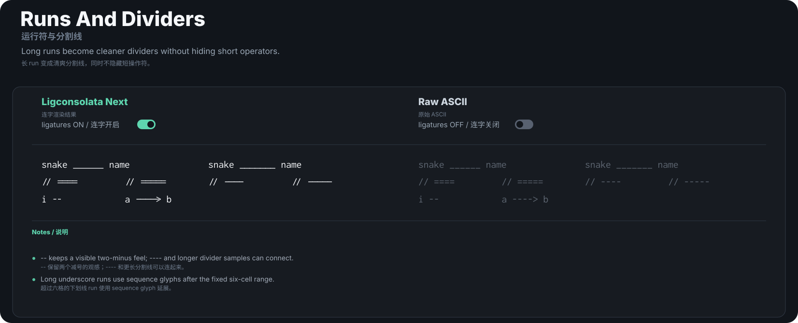

Samples / 样例: [Open in playground / 在 Playground 打开](demo/index.html?sample=snake%20______%20name%0Asnake%20_______%20name%0A%2F%2F%20%3D%3D%3D%3D%0A%2F%2F%20%3D%3D%3D%3D%3D%0A%2F%2F%20----%0A%2F%2F%20-----%0Ai%20--%0Aa%20----%3E%20b)

```text
snake ______ name
snake _______ name
// ====
// =====
// ----
// -----
i --
a ----> b
```

### CJK Dash Width And Continuity / 中文破折号宽度与连续性

Tags: `glyph width`

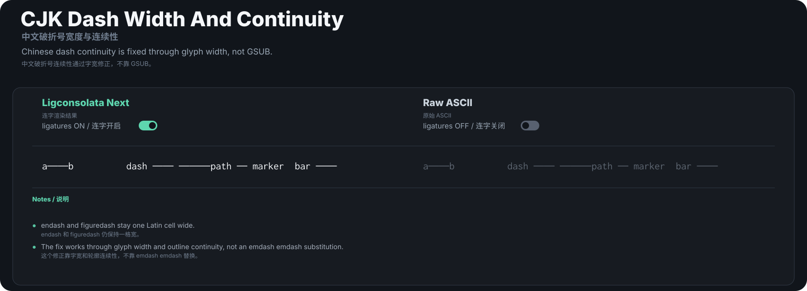

Samples / 样例: [Open in playground / 在 Playground 打开](demo/index.html?sample=a%E2%80%94%E2%80%94b%0Adash%20%E2%80%94%E2%80%94%20%E2%80%94%E2%80%94%E2%80%94%0Apath%20%E2%80%95%20marker%0Abar%20%E2%80%95%E2%80%95)

```text
a——b
dash —— ———
path ― marker
bar ――
```

### Thin Backslash / 细反斜杠

Tags: `calt`

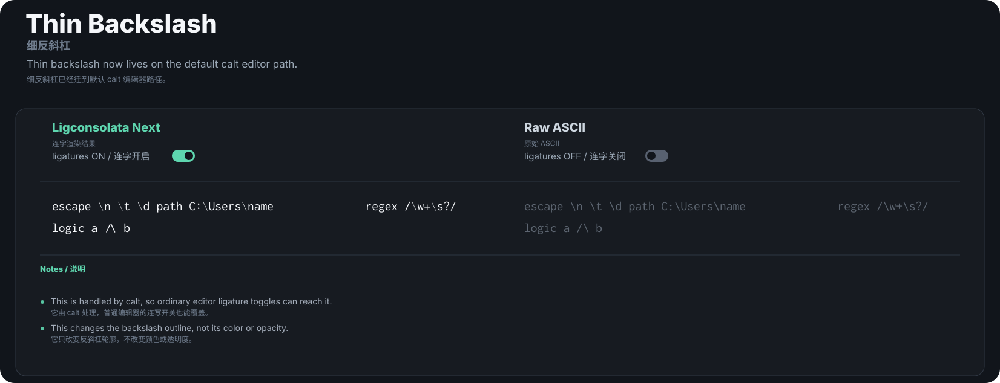

Samples / 样例: [Open in playground / 在 Playground 打开](demo/index.html?sample=escape%20%5Cn%20%5Ct%20%5Cd%0Apath%20C%3A%5CUsers%5Cname%0Aregex%20%2F%5Cw%2B%5Cs%3F%2F%0Alogic%20a%20%2F%5C%20b)

```text
escape \n \t \d
path C:\Users\name
regex /\w+\s?/
logic a /\ b
```

## Complete Rule Inventory

`scripts/update-ligature-glyphs.py` currently maintains `144` generated ligature rules. The fixed/default-friendly source sequences are:

`=====` `-----` `====` `----` `!==` `===` `<=>` `<->`
`-->` `<--` `==>` `<==` `______` `_____` `____` `___`
`__` `=/=` `=!=` `=:=` `=~` `!~` `/==` `/=`
`.=` `.-` `:-` `[]` `->>` `<<-` `=>>` `=<<`
`>--` `--<` `|--` `--|` `>==` `==<` `|==` `==|`
`==/` `>>-` `>-` `-<` `||-` `-||` `|->` `<-|`
`|=>` `<=|` `-|` `|-` `...` `!=` `==` `->`
`=>` `>=` `<-` `<=` `<>` `::` `:=` `&&`
`||` `++` `--` `**` `/*` `*/` `??` `?.`
`|||>` `<|||` `<!--` `~~>` `***` `|||` `||>` `:::`
`::=` `!!.` `>>>` `<~~` `<~>` `<*>` `<||` `<|>`
`<$>` `<<<` `<+>` `</>` `#_(` `..=` `..<` `+++`
`^=` `~~` `~@` `~>` `~-` `*>` `|}` `|]`
`|>` `{|` `[|` `]#` `$>` `!!` `>>` `-~`
`<~` `<*` `<|` `<$` `<<` `<+` `</` `#{`
`#[` `#:` `#=` `#!` `#(` `#?` `#_` `%%`
`..` `.?` `+>` `?=` `;;` `\\` `/>`

Contextual Markdown badge sources:

`######` `#####` `####` `###` `##`

Comment-prefix guarded sources:

`//` `///`

Space-around logic guard sources:

`/\` `\/`

Sequence/helper glyphs used by `calt`:

`hyphen_start.seq` `hyphen_middle.seq` `hyphen_end.seq` `less_hyphen_start.seq`
`less_hyphen_end.seq` `greater_hyphen_start.seq` `greater_hyphen_end.seq` `equal_start.seq`
`equal_middle.seq` `equal_end.seq` `less_equal_start.seq` `less_equal_end.seq`
`greater_equal_start.seq` `greater_equal_end.seq` `underscore_start.seq` `underscore_middle.seq`
`underscore_end.seq` `bar_hyphen_start.seq` `bar_hyphen_end.seq` `bar_equal_start.seq`
`bar_equal_end.seq` `slash_equal_start.seq` `slash_equal_middle.seq` `slash_equal_end.seq`
`colon_equal_middle.seq` `exclam_equal_middle.seq` `numbersign_start.seq` `numbersign_middle.seq`
`numbersign_end.seq`

Visual alternate glyphs generated for contextual behavior:

`colon.center` `less.center` `greater.center` `hyphen.lc` `plus.lc` `asterisk.lc`
`colon.uc` `x.multiply` `backslash.thin`

Zero-width spacer helper glyphs:

`slash_comment_spacer` `slash_logic_spacer` `backslash_logic_spacer` `numbersign_badge_spacer`

## Regeneration

```sh
python scripts/build-demo-assets.py
python scripts/generate-feature-gallery.py
```

The generated SVGs live in `documentation/img/features/`.
