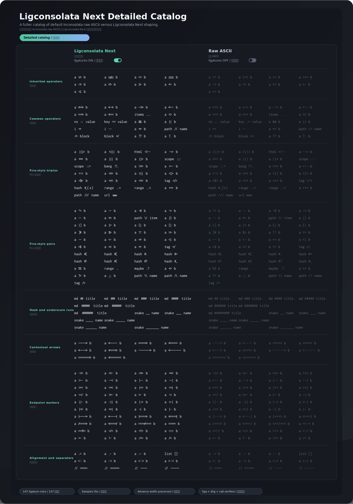

# Ligconsolata Next 优化目录

这份文档记录 Ligconsolata Next 相比默认 Inconsolata 编辑器体验做了哪些优化。README 顶部的 SVG 只保留代表性样例；这里放更完整的目录、边界和维护方式。

## 对比基准

这里的“默认 Inconsolata”指多数编辑器里只开启常规 `liga` 时的表现。上游 Inconsolata 已经包含一小组编程连字，但这些连字主要放在 `dlig`，很多编辑器不会默认启用，所以开发者通常看到的是原始 ASCII。

Ligconsolata Next 做的是增量优化：

- 保留 Inconsolata 的字母、括号、整体节奏和等宽纹理。
- 把已有编程连字同步暴露到 `liga`。
- 参考 Fira Code 的覆盖面和 OpenType 行为，补充固定连字和一部分低风险 `calt` 上下文规则。
- 所有连字都保持原始 ASCII 序列的 advance width，不改变代码列宽和光标节奏。
- 不复制 Fira Code、JetBrains Mono 或其他字体的 outline。

## 详细对比图



这张图由 `documentation/ligature-catalog-samples.txt` 生成。左侧是实际构建出的 Ligconsolata Next，在 `liga`、`dlig`、`calt` 开启时的 shaping 结果；右侧是同一段 ASCII 源文本的 raw glyph 序列。

它不是手绘示意图，也没有把 `=>`、`<=`、`!=` 替换成 Unicode 数学符号。生成脚本会读取真实字体 outline，并用 `hb-shape` 检查 OpenType 替换结果。

## 当前优化清单

### 继承并默认启用的操作符

上游已有的一组编程连字继续保留，并从 `dlig` 同步到 `liga`：

```text
!= !== == === -> => >= <- <=
```

其中 `==` 和 `!=` 必须保持两条横线，不能从三横线版本横向压缩出来。`!==` 和 `===` 仍然是三字符连字，视觉上需要和两字符版本区分。

### 新增常用固定连字

这些是日常代码里很常见的操作符，优先按固定 glyph 处理：

```text
<=> <-> --> <-- ==> <== ... <> :: := && || ++ -- ** // /* */ ?? ?.
```

`--` 保留两个减号的分隔感，不做成连续横线。连续分割线由更长的 `----` / `-----` 负责。

### Fira Code-inspired 固定覆盖

这一组主要参考 Fira Code 静态 `liga` 覆盖面，但 glyph 仍从 Inconsolata 自己的笔画和比例推导：

```text
<|> <$> <+> </> |> <| ::= ::: ..= ..< ?= !! !!. +++ *** /// www
|||> <||| <!-- ~~> >>> <~~ <~> <*> <|| <<< #_( #{ #[ #: #= #! #( #? #_
^= ~~ ~@ ~> ~- *> \/ |} |] {| [| ]# $> >> -~ <~ <* <$ << <+ </ %% .. .? +> ;; \\ /\ />
```

这类固定覆盖适合先迁移，因为它们不需要复杂上下文判断，也更容易做宽度校验。

### 运行符和分割线

当前对 hash、underscore、equal、hyphen 运行符做了分层处理：

```text
## ### #### ##### ###### ####### ########
__ ___ ____ _____ ______
==== ===== ---- -----
```

更长的 underscore run 已经用 `calt` 做上下文延展。hash run 暂时保留固定覆盖，没有直接做自动拼接，因为 `#` 的斜竖和横线需要单独设计 start / middle / end 视觉片段。

### 上下文箭头

Fira Code 的长箭头体验很好，但不能直接照搬 outline。Ligconsolata Next 用自己的 seq glyph 做 start / middle / end 拼接：

```text
----> <---- ====> <==== <---> <===>
```

这类规则需要小心 lookup 顺序。普通 `==`、`===`、`!==`、`--`、`->`、`=>` 等固定连字不能被长箭头 `calt` 抢走。

### 端点与 marker

当前已经迁移一批低风险端点和 marker：

```text
|---> <---| |===> <===|
/===> <===/ ===/=== ==:= ==!=
|-- --| |== ==| |-> <-| |=> <=|
>-- --< >== ==< ==/ >>- >- -< ||- -|| -| |-
=/= =!= =:= =~ !~ /== /=
```

双 slash 端点、双字符端点和更完整 `.spacer` 机制暂缓。它们容易和 `//`、`///`、URL、路径、注释前缀冲突，需要更完整的测试样例和视觉设计。

### 标点对齐

第一批 center alignment 覆盖这些场景：

```text
:< :> <: >: <:> >:<
```

这不是新增 `.dlig` 连字，而是在 `calt` 中把 `:`、`<`、`>` 切到 `.center` 视觉变体，让冒号和尖括号在操作符上下文里更居中。

## 还没有宣称完成的部分

这些方向已经进入队列，但还没有写成默认支持：

- lowercase / uppercase operator matching，例如 `hyphen.lc`、`plus.lc`、`asterisk.lc`、`colon.uc`。
- hexadecimal / multiplication `x` 行为，例如 `0xFF`、`800x600`。
- hash run 的上下文型 start / middle / end 设计。
- double slash endpoint、多冒号 center、更多 Fira Code `.spacer` 行为。
- `cv` / `ss` 特性边界，以及哪些视觉变体应该默认启用、哪些应该作为 opt-in。
- 多 master、多字重、多编辑器的系统视觉 QA。

## 更新方式

修改详细 catalog 时先改配置：

```sh
documentation/ligature-catalog-samples.txt
```

然后生成 SVG：

```sh
python scripts/generate-overview-svg.py --build \
  --samples documentation/ligature-catalog-samples.txt \
  --output documentation/img/ligconsolata-next-ligature-catalog.svg \
  --title "Ligconsolata Next Detailed Catalog" \
  --subtitle "A fuller catalog of default Inconsolata raw ASCII versus Ligconsolata Next shaping." \
  --subtitle-cn "更完整地展示默认 Inconsolata raw ASCII 与 Ligconsolata Next 连字渲染之间的差异。" \
  --badge "Detailed catalog / 详细目录"
```

overview 和 catalog 都只是展示层。真实规则来源仍是 `scripts/update-ligature-glyphs.py`，迁移经验和坑点记录在 `documentation/ligature-porting-notes.md`。
