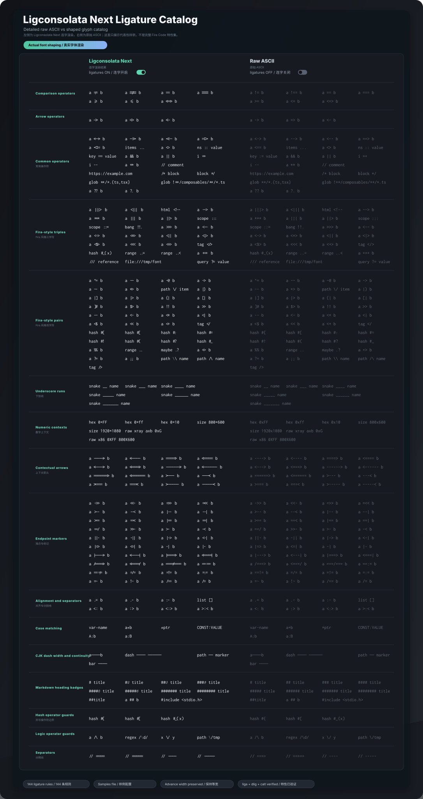
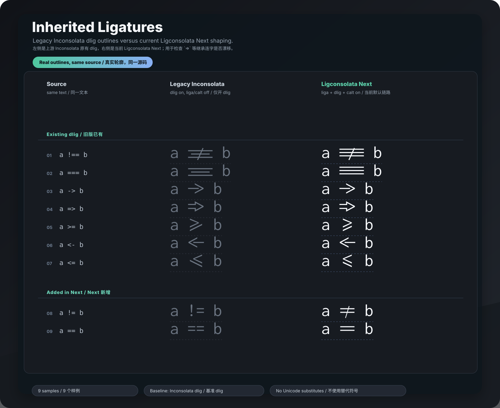

# Ligconsolata Next 优化目录

这份文档记录 Ligconsolata Next 相比默认 Inconsolata 编辑器体验做了哪些优化。README 顶部的 SVG 只保留代表性样例；这里放更完整的目录、边界和维护方式。

## 对比基准

这里的“默认 Inconsolata”指多数编辑器里只开启常规 `liga` 时的表现。上游 Inconsolata 已经包含一小组编程连字，但这些连字主要放在 `dlig`，很多编辑器不会默认启用，所以开发者通常看到的是原始 ASCII。

Ligconsolata Next 做的是增量优化：

- 保留 Inconsolata 的字母、括号、整体节奏和等宽纹理。
- 把已有编程连字同步暴露到 `liga`。
- 参考 Fira Code 的覆盖面和 OpenType 行为，补充固定连字和一部分低风险 `calt` 上下文规则。
- 所有连字都保持原始 ASCII 序列的 advance width，不改变代码列宽和光标节奏。
- 不复制 Fira Code、JetBrains Mono 或其他字体的 outline。

## 详细对比图



这张图由 `documentation/ligature-catalog-samples.txt` 生成。左侧是实际构建出的 Ligconsolata Next，在 `liga`、`dlig`、`calt` 开启时的 shaping 结果；右侧是同一段源文本的 raw glyph 序列。大多数样例是 ASCII 操作符；CJK dash 小节会刻意包含 U+2014 / U+2015 标点。

它不是手绘示意图，也没有把 `=>`、`<=`、`!=` 替换成 Unicode 数学符号。生成脚本会读取真实字体 outline，并用 `hb-shape` 检查 OpenType 替换结果。

## 继承连字对比图



这张图专门比较上游 Inconsolata 原本放在 `dlig` 里的编程连字，和当前 Ligconsolata Next 的实际渲染结果。左侧使用 `fonts/variable/Inconsolata[wdth,wght].ttf`，只开启 `dlig`；右侧使用当前源码临时构建出的 Ligconsolata Next，同时开启 `liga`、`dlig` 和 `calt`。

它的用途更窄：当 `=>`、`->`、`<=` 这类继承连字看起来和旧版不一样时，先看这张图确认是否真的发生 outline 漂移。这里也会把 `!=` 和 `==` 单独列为 Next 新增项，因为当前上游变量字体里它们不是同一组已有 `dlig`。

## 当前优化清单

### 继承并默认启用的操作符

当前上游变量字体里可验证的一组 `dlig` 编程连字继续保留，并同步暴露到 `liga`：

```text
!== === -> => >= <- <=
```

`!=` 和 `==` 是 Ligconsolata Next 额外补上的两字符形态，并且必须保持两条横线，不能从三横线版本横向压缩出来。`!==` 和 `===` 仍然是三字符连字，视觉上需要和两字符版本区分。

### 新增常用固定连字

这些是日常代码里很常见的操作符，优先按固定 glyph 处理：

```text
<=> <-> --> <-- ==> <== ... <> :: := && || ++ -- ** /* */ ?? ?.
```

`--` 保留两个减号的分隔感，不做成连续横线。连续分割线由更长的 `----` / `-----` 负责。

`//` 和 `///` 注释前缀采用上下文规则：只有后面跟普通空格时才启用，例如 `// comment`、`/// reference`。`https://example.com`、`file:///tmp/font`、路径和其他非注释文本里的 slash 会保留原始斜线。

### Fira Code-inspired 固定覆盖

这一组主要参考 Fira Code 静态 `liga` 覆盖面，但 glyph 仍从 Inconsolata 自己的笔画和比例推导：

```text
<|> <$> <+> </> |> <| ::= ::: ..= ..< ?= !! !!. +++ ***
|||> <||| <!-- ~~> >>> <~~ <~> <*> <|| <<< #_( #{ #[ #: #= #! #( #? #_
^= ~~ ~@ ~> ~- *> \/ |} |] {| [| ]# $> >> -~ <~ <* <$ << <+ </ %% .. .? +> ;; \\ /\ />
```

这类固定覆盖适合先迁移，因为它们不需要复杂上下文判断，也更容易做宽度校验。Fira Code 默认支持 `www` 合并，但 Ligconsolata Next 不把它放进默认规则：URL、域名和普通文本里 `www` 本来就足够清楚，合并后收益不大，还可能让真实地址更难扫读。

### 运行符和分割线

当前对 hash、underscore、equal、hyphen 运行符做了分层处理：

```text
## ### #### ##### ###### ####### ########
__ ___ ____ _____ ______
==== ===== ---- -----
```

更长的 underscore run 已经用 `calt` 做上下文延展。Markdown 标题里的 hash run 改成了分层方案：位于 shaping run 开头且后接普通空格的 `## title` 到 `###### title` 保持原始字符序列的总 advance width，把井号横杠连成一组，并在最后一个 `#` 的右上区域嵌入数字 `2` 到 `6`，让标题层级仍然一眼可数。单个 `#`、紧贴文本的 `##title`、行内文本 `a ## b` 保持 raw glyph，避免行内文本误伤；`#######` 及更长 run 会用 start / middle / end 片段连成无编号井号横杠序列，让长分割线连续，但不假装成 Markdown 标题层级。

### 上下文箭头

Fira Code 的长箭头体验很好，但不能直接照搬 outline。Ligconsolata Next 用自己的 seq glyph 做 start / middle / end 拼接：

```text
----> <---- ====> <==== <---> <===>
>--- ---< >=== ===<
```

这类规则需要小心 lookup 顺序。普通 `==`、`===`、`!==`、`--`、`->`、`=>` 等固定连字不能被长箭头 `calt` 抢走。

### 端点与 marker

当前已经迁移一批低风险端点和 marker：

```text
|---> <---| |===> <===|
/===> <===/ ===/=== ==:= ==!=
|-- --| |== ==| |-> <-| |=> <=|
>-- --< >== ==< ==/ >>- >- -< ||- -|| -| |-
=/= =!= =:= =~ !~ /== /=
```

双 slash 端点、双字符端点和更完整 `.spacer` 机制暂缓。它们容易和 `//`、`///`、URL、路径、注释前缀冲突，需要更完整的测试样例和视觉设计。

`/\` 和 `\/` 也参考 Fira Code 的逻辑与 / 逻辑或思路，但默认只在两侧都有普通空格时启用，例如 `a /\ b`、`x \/ y`。正则 `/\d/`、转义路径 `\/tmp` 和普通字符串里的 slash / backslash 保持 raw，避免为了一个操作符把代码里的转义序列变模糊。

### 标点对齐

第一批 center alignment 覆盖这些场景：

```text
:< :> <: >: <:> >:<
```

这不是新增 `.dlig` 连字，而是在 `calt` 中把 `:`、`<`、`>` 切到 `.center` 视觉变体，让冒号和尖括号在操作符上下文里更居中。

### 大小写上下文标点

这一批参考 Fira Code 的 lowercase / uppercase operator matching，但只迁移上下文行为，不迁移 outline：

```text
var-name a+b *ptr CONST:VALUE
```

`var-name`、`a+b`、`*ptr` 这类小写上下文会把 `-`、`+`、`*` 切到 `.lc` 视觉变体，让符号更靠近小写字母的视觉中心。`CONST:VALUE` 这类大写或 tall 上下文会把 `:` 切到 `.uc` 视觉变体，让冒号更靠近大写字母、数字、括号等高字形。混合大小写上下文如 `A:b`、`a:B` 会保持原始 glyph，避免符号被错误抬高或压低。

这些替换都保持一格 advance width，不改变代码列宽。长箭头和固定连字仍然优先保护：`i--`、`->`、`=>`、`==`、`===`、`====`、`-->`、`==>` 等不会被这一批 `calt` 规则抢走。

### 中文破折号宽度和连续性

上游 Inconsolata 的 `emdash` (U+2014) 和 `horizontalbar` (U+2015) 原本都是一格 Latin cell 宽。这个设定在纯西文等宽环境里可以理解，但放到中文混排里会让常见的 `——` 只占两个英文字母宽，看起来不像中文破折号。

Ligconsolata Next 将 U+2014 和 U+2015 调整为两倍当前 Latin cell 宽度：Regular 默认位置是 1000，Ultra Condensed 是 500，Ultra Expanded 是 2000。同时，`emdash` 的横线轮廓会延伸到当前 advance 两端，`horizontalbar` 继续复用 `emdash` 组件，所以 `——`、`――` 和更长 dash run 都能自然连成一条线。

这里没有新增 `emdash emdash` 的 OpenType 连字。原因是中文破折号可能连续两个、三个或更多字符，直接让单个 U+2014 / U+2015 边缘连续，比枚举 GSUB 连字更稳定，也不依赖编辑器是否开启 `liga`。

`endash` (U+2013) 和 `figuredash` (U+2012) 仍保持一格且保留原本左右留白，避免影响西文范围和数字排版。

`documentation/demo/index.html` 的默认样例已包含 `a——b` 和 `path ― marker`，可以直接用本地 demo 对比一格 dash 与两格 dash 的差异。

这不是 Fira Code 式操作符连字，也不由 `scripts/update-ligature-glyphs.py` 生成；它是 Glyphs 源码里的基础标点宽度和轮廓连续性修正。

### 数字上下文里的 x

Fira Code 会在 `0xFF` 和 `800x600` 这类上下文中把小写 `x` 换成乘号语义的形态。Ligconsolata Next 迁移了不依赖 `onum` 的默认小批次：

```text
0xFF 0xff 0x10
800x600 1920x1080
```

这里不是把所有 `x` 都换掉。`xray`、`axb`、`0xG`、`0XFF`、`800X600`、`x86`、`x64` 继续保持 raw glyph，避免误伤单词、变量名和常见架构名。

`x.multiply` 从 Inconsolata 自己的 `multiply` 符号派生，保持一格 advance width，并且在生成脚本里清空 Unicode，避免把上下文替换 glyph 当作 U+00D7 本体。

## 还没有宣称完成的部分

这些方向已经评估过，目前不写成默认支持：

- double slash endpoint、多冒号 center、更多 Fira Code `.spacer` 行为。
- `bar_underscore_middle.seq` / `_|_` 这类 diagram 或 progress-bar 机制。
- Greek 大写变音、`fi` / `fl` 文本连字、`twoemdash` / `threeemdash` GSUB、`asteriskmath`、old-style figure `.tosf` 分支。
- 更完整的 opt-in `ss` / `cv` feature 包，例如水平 bar 版 `<=` / `>=`、零形态、括号风格或其他字符变体。thin backslash 已经按当前产品决策迁到默认 `calt` 路径：它把反斜杠换成更细的内部 glyph `backslash.thin`，方便用户在 regex / escape 里弱化转义符本身；后续不要再把核心编码体验放进新 `ssXX` / `cvXX`，除非同时给出主流编辑器可用性的明确证据。
- 多 master、多字重、多编辑器的系统视觉 QA。

## 更新方式

修改详细 catalog 时先改配置：

```sh
documentation/ligature-catalog-samples.txt
```

然后生成 SVG：

```sh
python scripts/generate-overview-svg.py --build \
  --samples documentation/ligature-catalog-samples.txt \
  --output documentation/img/ligconsolata-next-ligature-catalog.svg \
  --title "Ligconsolata Next Detailed Catalog" \
  --subtitle "A fuller catalog of default Inconsolata source glyphs versus Ligconsolata Next shaping." \
  --subtitle-cn "更完整地展示默认 Inconsolata 源文本字形与 Ligconsolata Next shaping 之间的差异。" \
  --badge "Detailed catalog / 详细目录"
```

overview 和 catalog 都只是展示层。真实规则来源仍是 `scripts/update-ligature-glyphs.py`，迁移经验和坑点记录在 `documentation/ligature-porting-notes.md`。

继承连字对比图使用单独配置：

```sh
documentation/inherited-ligature-comparison-samples.txt
```

生成命令：

```sh
python scripts/generate-inherited-comparison-svg.py --build
```

这张图的 baseline 是 `fonts/variable/Inconsolata[wdth,wght].ttf`，不是 raw ASCII。它只用于检查 Ligconsolata Next 是否改变了上游已有 `dlig` 的视觉形态，不替代完整 catalog。

## QA 和外部参考

更偏 review 的视觉样例放在 [Ligconsolata Next 视觉 QA](ligconsolata-next-qa.md)。那里单独覆盖易混字符、`==` / `===`、`!=` / `!==`、URL/comment 边界、Markdown `#` 标题、不同字号和不同字重。QA SVG 由 `scripts/generate-qa-svg.py` 生成，和 overview / catalog 一样读取真实构建字体的 outline。

外部编码字体的借鉴边界放在 [外部编码字体参考索引](external-font-reference-index.md)。当前结论是：Fira Code 作为连字行为主参考，JetBrains Mono 参考易读性 QA，Cascadia Code 参考发行拆分，Iosevka 参考可配置边界，Monaspace 参考 texture healing 的 QA 思路，Intel One Mono 参考可访问性和 opt-in 连字策略。这些项目只提供行为、文档和 QA 启发，不提供 Ligconsolata Next 的 outline 来源。
