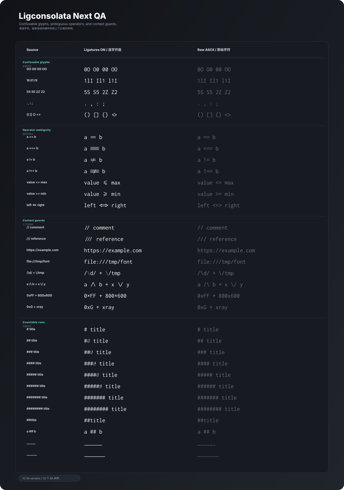
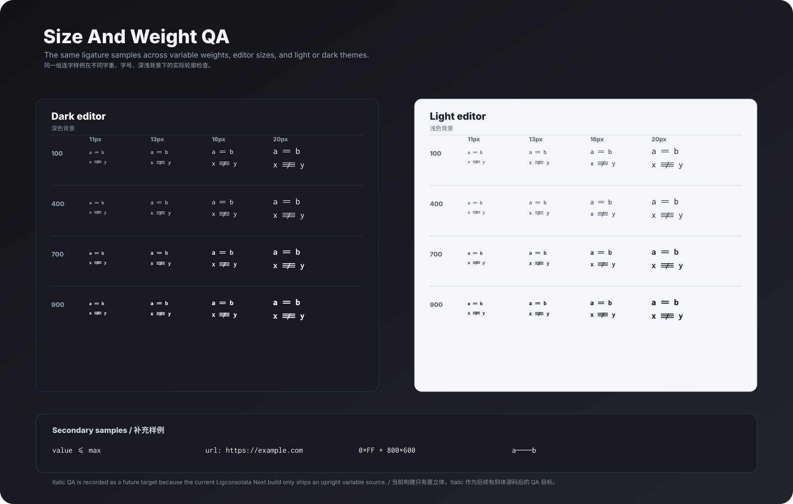

# Ligconsolata Next 视觉 QA

这份文档记录当前 Ligconsolata Next 的视觉 QA 样例。它和 README 顶部 overview 的职责不同：overview 用来快速展示项目气质，QA 图用来发现误读、重心偏移、上下文误伤和小字号问题。

## 易混字符和操作符歧义



这张图由 `documentation/qa/confusable-samples.txt` 生成，重点看四类问题：

- 易混字符：`0/O`、`1/l/I`、`5/S`、`2/Z`、`.` / `,`、`:` / `;`。
- 操作符歧义：`==` / `===`、`!=` / `!==`、`<=` / `>=`、`<=>`。
- 上下文保护：`// comment` 应触发注释前缀连字，但 `https://example.com` 和 `file:///tmp/font` 不应该被 slash 连字误伤。
- 可数字符：行首 Markdown 标题里的 `## title` 到 `###### title` 会显示右上嵌入式数字徽标，`#`、`##title`、`a ## b` 保持原始字符；`#######` 及更长 run 会连成无编号长井号序列；下划线 run 可以延展但不能压坏后续文字。

这张图左侧是开启 `liga` / `dlig` / `calt` 后的真实 shaping，右侧是同一源码的 raw ASCII 序列。它用实际构建字体的 outline 生成，不用 Unicode 数学符号替代。

## 字号、字重和背景矩阵



这张图由 `documentation/qa/matrix-samples.txt` 生成，当前覆盖：

- `wght` axis 的边界、默认值和常用粗字重：脚本会从字体 `fvar` 里读取最小值、默认值、`700` 和最大值。
- 常见编辑器字号：`11px`、`13px`、`16px`、`20px`。
- 深色背景和浅色背景。
- `==` / `!==` 这类必须区分横线数量的操作符，以及 `<=`、URL、numeric `x` 和中文破折号等补充样例。

当前 Ligconsolata Next 构建只包含 upright variable source，所以这张矩阵把 Italic 记录为未来 QA 目标，而不是假装已经覆盖。等后续真的有 italic 源码后，再把 italic panel 加进脚本，并单独检查斜体里的 `==`、`!==`、`<=`、`>=`、`x.multiply` 和 bracket pair。

## 生成命令

先确保有可用的 smoke build 或 demo font：

```sh
fontmake -g sources/Inconsolata.glyphs -o variable \
  --master-dir "{tmp}" \
  --output-path "/tmp/ligconsolata-next-smoke/LigconsolataNext[wdth,wght].ttf"
```

然后生成 QA SVG：

```sh
python scripts/generate-qa-svg.py \
  --font "/tmp/ligconsolata-next-smoke/LigconsolataNext[wdth,wght].ttf"
```

如果不传 `--font`，脚本会优先使用 `/tmp/ligconsolata-next-smoke/LigconsolataNext[wdth,wght].ttf`，否则回退到 `documentation/demo/fonts/LigconsolataNext[wdth,wght].ttf`。

## Review 时看什么

检查连字时不要只看 GSUB 是否替换成功，还要看它是否会误导读者：

- `==` 应该明显是两条横线，`===` 应该明显是三条横线。
- `!=` 和 `!==` 的 slash / equal 重心要和 equality 组一致。
- `<=` / `>=` 默认是 comparison，不是箭头；两条斜线应平行、等长、居中。
- `//` 只应在注释前缀上下文触发，URL 和路径要保留 raw slash。
- `## title` 到 `###### title` 的数字徽标只能用于行首标题标记；`#`、`##title`、`a ## b` 必须保持 raw；`#######` 及更长 run 应连成无编号长井号序列，但不能出现数字徽标。
- 小字号和粗字重下，连字不能糊成一个看不出层级的块。
- 深浅背景里都要看，不要只在 README 的暗色 specimen 里确认。

QA 图不是发布证明。真正修改 glyph 或 OpenType feature 后，仍然要走 smoke build、GSUB、宽度检查、overview / catalog / demo 的完整链路。
